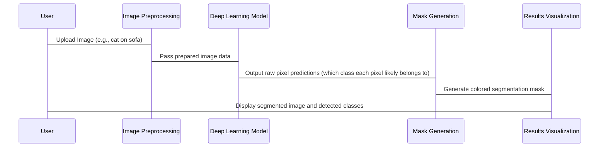

# Chapter 1: Deep Learning Workflow Description

Welcome to the exciting world of Deep Learning for Image Segmentation! If you're new to this, don't worry – this chapter is your friendly guide to understanding the big picture, like a user manual for our entire project. We're going to break down how computers can "see" and understand images, step by step.

### What Problem Are We Solving?

Imagine you have a photograph, say, a picture of a street with cars, people, and buildings. Now, what if you wanted a computer to not just *know* there are cars in the picture, but to precisely outline *where* each car is, pixel by pixel? Or *where* each person is? This amazing ability is called **Image Segmentation**.

This project helps a computer do exactly that! It takes an image and creates a "mask" or a "colored map" on top of it, highlighting different objects with different colors. It's like having a digital coloring book where the computer automatically colors in all the cars in blue, all the people in green, and all the buildings in red.

### The Deep Learning "Assembly Line": Our Workflow

Solving this problem with deep learning involves a series of connected steps, much like an assembly line in a factory. Each step takes something as input, does its job, and passes its output to the next step. Understanding this flow is key to grasping how the entire system works.

Here's a high-level overview of our deep learning workflow:

1.  **Get the Image Ready (Image Preprocessing):** Computers don't see images the way we do. We need to prepare the image so the deep learning model can understand it. Think of it as cleaning up a messy room before you can organize it.
2.  **The Smart Brain (Deep Learning Model):** This is the core of our system, a special computer program trained to recognize patterns and objects in images. It's like a highly trained detective looking for clues.
3.  **Making a Guess (Model Inference):** Once the image is ready, we feed it into our "smart brain" model. The model then processes it and makes predictions about what's in the image, pixel by pixel.
4.  **Drawing the Map (Segmentation Mask Generation):** The model's raw predictions are a bit like a jumbled list of probabilities. We need to turn this into a clear, visual map – our segmentation mask – where each pixel is assigned to a specific object class (e.g., "car," "person," "background").
5.  **Adding Colors and Labels (Class Definition and Coloring):** To make the segmentation mask easy for humans to understand, we assign specific colors to each object class. This way, all cars might be blue, all people green, etc.
6.  **Showing Off the Results (Results Visualization):** Finally, we display the original image, the raw segmentation mask, and an "overlay" where the colored mask is gently placed on top of the original image, so you can see both the objects and their original context.

### Conceptual Walkthrough: What Happens Behind the Scenes?

Let's imagine you give our system an image of a cat sitting on a sofa. Here's a simplified sequence of what happens:



### Diving into the Code (Simplified View)

While we'll explore each step in much more detail in later chapters, let's peek at some super-simplified code snippets from `main.py` to see how these conceptual steps translate into actions. Don't worry about understanding every line yet; just focus on the overall idea!

#### 1. Getting Your Image Ready (Image Preprocessing)

First, we need to load your image and prepare it. This involves things like resizing it to a standard size and making small adjustments so the model can understand it. You can learn more about this in [Image Preprocessing Pipeline](04_image_preprocessing_pipeline_.md).

```python
from PIL import Image
from torchvision import transforms

# Imagine 'img_path' is where your uploaded image is stored
input_image = Image.open(img_path).convert("RGB")

# This "preprocess" set of instructions will clean up and format our image
preprocess = transforms.Compose([
    transforms.Resize((520, 520)), # Make all images 520x520 pixels
    transforms.ToTensor(),         # Convert image to numbers (tensor)
    # ... more complex steps here to normalize colors ...
])

input_tensor = preprocess(input_image).unsqueeze(0) # Apply the cleaning steps
```
**What happened?** We took your chosen image, opened it, and then applied a series of transformations (like resizing) to make it suitable for our deep learning model. The output `input_tensor` is the "cleaned" digital version of your image.

#### 2. The Smart Brain (Deep Learning Model)

Next, we load our powerful deep learning model. This model has already been "trained" on thousands of images to learn what different objects look like. We'll dive deeper into how these models work in [Semantic Segmentation Model](02_semantic_segmentation_model_.md).

```python
import torchvision

# Choose which 'smart brain' model to use (FCN or DeepLabV3)
use_fcn = False # For this example, let's pick DeepLabV3

if use_fcn:
    model = torchvision.models.segmentation.fcn_resnet50(pretrained=True).eval()
else:
    model = torchvision.models.segmentation.deeplabv3_resnet50(pretrained=True).eval()
print("Using DeepLabV3 ResNet50 model")
```
**What happened?** We picked a specialized pre-trained model (like DeepLabV3) that's really good at image segmentation. This model is now ready to receive our prepared image.

#### 3. Making a Guess (Model Inference)

Now, we feed our prepared image into the loaded model. The model then processes the image and outputs its predictions about what's in every single pixel. This process is called "inference," and you'll learn more about it in [Model Inference Engine](03_model_inference_engine_.md).

```python
import torch

# Ask the model to make predictions using our prepared image
with torch.no_grad(): # We don't need to learn anything new, just predict!
    output = model(input_tensor)["out"][0]
```
**What happened?** The `model(input_tensor)` line is where the magic happens! Our model "looks" at the `input_tensor` (your prepared image) and produces an `output`. This `output` contains raw scores for each pixel, indicating how likely it is to belong to each possible object class.

#### 4. Drawing the Map (Segmentation Mask Generation)

The `output` from the model is raw numbers. We need to convert these numbers into a clear map where each pixel is assigned to its most likely object class. This creates our raw segmentation mask. More details are in [Segmentation Mask Generation](05_segmentation_mask_generation_.md).

```python
import numpy as np

# For each pixel, pick the class with the highest score
pred = output.argmax(0).byte().cpu().numpy()
```
**What happened?** The `argmax(0)` part is like saying, "For every pixel, look at all the class scores and tell me which class has the *highest* score." This gives us a simple map (`pred`) where each pixel's value is now a number representing its detected class (e.g., 0 for background, 1 for airplane, 7 for car, etc.).

#### 5. Adding Colors and Labels (Class Definition and Coloring)

To make our `pred` map visually understandable, we define what each class number means (e.g., 7 is a 'car') and assign a unique color to it. This helps us see the segmentation clearly. Check out [Class Definition and Coloring](06_class_definition_and_coloring_.md) for more.

```python
# Define what each number means (e.g., 7 = 'car')
VOC_CLASSES = [
    'background', 'aeroplane', 'bicycle', 'bird', 'boat',
    # ... many more classes ...
    'person', 'potted plant', 'sheep', 'sofa', 'train',
    'tv/monitor'
]

# Create a random color for each class
np.random.seed(42) # For consistent colors each time
colors = np.random.randint(0, 255, size=(len(VOC_CLASSES), 3), dtype=np.uint8)

# Apply these colors to our prediction map
mask_color = colors[pred] # Now 'pred' is a colorful image!
```
**What happened?** We created a list of names for all the possible objects the model can detect (`VOC_CLASSES`). Then, we generated a unique color for each of these classes. Finally, we used our `pred` map (which has class numbers) to look up and apply the correct color for every pixel, creating a vibrant `mask_color` image.

#### 6. Showing Off the Results (Results Visualization)

The final step is to display our findings! We show the original image, the raw segmentation mask (just the colors), and a cool "overlay" where the colored mask is semi-transparently placed on the original image, giving you a complete view. You can learn more about this in [Results Visualization](07_results_visualization_.md).

```python
import matplotlib.pyplot as plt

# Create an image that blends the original picture with the colorful mask
overlay = (0.5 * np.array(input_image.resize((520,520))) + 0.5 * mask_color).astype(np.uint8)

# Now, let's show them!
plt.figure(figsize=(15,8))
plt.subplot(1,3,1) # Original image
plt.imshow(input_image)
plt.title("Original Image")

plt.subplot(1,3,2) # Raw colored mask
plt.imshow(pred, cmap="tab20b") # Using a default colormap for raw IDs
plt.title("Segmentation Mask")

plt.subplot(1,3,3) # Overlay
plt.imshow(overlay)
plt.title("Overlay (Segmentation + Image)")

plt.show() # Display all three images!
```
**What happened?** We combined our original image with the colorful segmentation mask to create a neat `overlay`. Then, using `matplotlib`, we displayed the original image, the raw mask, and the overlay side-by-side so you can easily compare and understand the results. We also printed a list of all objects detected in your image.

### Conclusion

Phew! You've just walked through the entire journey of an image through our deep learning segmentation project. From a simple photo, we've learned how to prepare it, let a smart model analyze it, convert its predictions into a clear map, color that map, and finally, display the beautiful results.

This chapter laid the conceptual groundwork for the entire pipeline. In the next chapter, we'll dive deeper into the "brain" of our operation: the [Semantic Segmentation Model](02_semantic_segmentation_model_.md), and understand how these incredible models actually work their magic!

---

Generated by [AI Codebase Knowledge Builder](https://github.com/The-Pocket/Tutorial-Codebase-Knowledge)