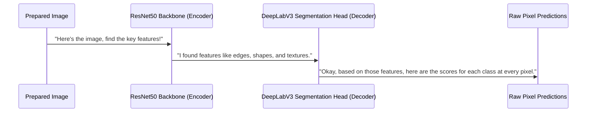

# Chapter 2: Semantic Segmentation Model

Welcome back! In [Chapter 1: Deep Learning Workflow Description](01_deep_learning_workflow_description_.md), we got a bird's-eye view of our project, seeing how an image travels through different steps, from preparation to final display. We likened it to an assembly line, and today we're going to zoom in on the most crucial part of that line: the "smart brain" or the **Semantic Segmentation Model**.

### What Problem Does the "Smart Brain" Solve?

Imagine you're an art teacher, and you ask your student to color a picture of a street scene. A beginner student might color the whole background blue and the foreground green. A slightly better student might color all cars red, all people yellow, but maybe miss some parts or go outside the lines.

Our deep learning model is like a highly specialized AI artist. Its job is not just to say, "Hey, there's a car in this picture!" but to meticulously "color in" *every single pixel* that belongs to a car, and *every single pixel* that belongs to a person, a building, or the sky. It needs to understand the picture at an incredibly detailed, pixel-by-pixel level.

This "AI artist" is our **Semantic Segmentation Model**. It's the core brain that performs the actual segmentation task, identifying and outlining every object in the image with extreme precision.

### The "AI Artist" in Detail: Our Semantic Segmentation Model

In our project, this AI artist is a sophisticated deep learning model. We specifically use two very powerful types: **FCN (Fully Convolutional Network)** or **DeepLabV3**. Both of these models are built upon a strong foundation called **ResNet50**.

Let's break down these fancy terms:

1.  **Pre-trained Model:**
    *   Think of "pre-trained" like an experienced artist who has already studied millions of paintings and knows exactly how to draw various objects – people, cars, trees, etc.
    *   Our models (FCN or DeepLabV3) have already "learned" from a massive dataset of labeled images (like ImageNet or COCO). This means they already have a good idea of what common objects look like, which saves us a lot of time and computing power. It's like hiring a seasoned professional rather than training a beginner from scratch!

2.  **ResNet50 Backbone:**
    *   Every great artist needs a strong skeleton or a steady hand. For our AI artist, that's the **ResNet50** backbone.
    *   ResNet50 is a type of **Convolutional Neural Network (CNN)**, which is fantastic at recognizing patterns and extracting important features from images. It acts like the "eyes" and "feature detectors" of our model, finding edges, textures, and shapes. It's the part that really "looks" at the image and understands its basic components.

3.  **FCN or DeepLabV3 (The Segmentation Head):**
    *   While ResNet50 is great at *seeing* things, FCN and DeepLabV3 are the "brains" that take those observations and turn them into a pixel-perfect segmentation map.
    *   They use the features extracted by ResNet50 to predict which object class each individual pixel belongs to (e.g., 'person', 'car', 'background'). This is why it's called "semantic" segmentation – it understands the *meaning* (semantic) of each pixel.

### How Our Project Uses the Semantic Segmentation Model

In `main.py`, we load this "AI artist" into our program. Remember from Chapter 1 that we have a choice between FCN and DeepLabV3. DeepLabV3 is generally considered more advanced and often performs better.

Here's the snippet from `main.py` that picks and loads our model:

```python
import torchvision

# Decide which 'smart brain' model to use
use_fcn = False # Set to True for FCN, False for DeepLabV3

if use_fcn:
    model = torchvision.models.segmentation.fcn_resnet50(pretrained=True).eval()
    print("Using FCN ResNet50 model")
else:
    model = torchvision.models.segmentation.deeplabv3_resnet50(pretrained=True).eval()
    print("Using DeepLabV3 ResNet50 model")
```
**What happened?**
1.  We import `torchvision`, a library that gives us access to many pre-built deep learning models.
2.  We choose between `fcn_resnet50` or `deeplabv3_resnet50`.
3.  `pretrained=True` tells the system to load a version of the model that has already learned from millions of images. This is crucial for getting good results quickly.
4.  `.eval()` puts the model into "evaluation mode." This means it's ready to *make predictions* and won't try to "learn" anything new, which is perfect for our task.
5.  The `model` variable now holds our entire "AI artist" – ready to process images!

The input to this model will be the prepared image from the [Image Preprocessing Pipeline](04_image_preprocessing_pipeline_.md). The output will be a raw set of scores for every pixel, indicating how strongly the model believes that pixel belongs to each possible object class. This raw output is then passed to the [Model Inference Engine](03_model_inference_engine_.md) for the next step.

### Inside the "AI Artist": A Peek Under the Hood

How does this model actually work its magic? Let's simplify the process:

#### Step-by-Step Walkthrough

Imagine you feed an image of a cat on a sofa to our loaded `model`.

1.  **Feature Extraction (ResNet50 - The Encoder):**
    *   The ResNet50 part of the model first looks at the image. It's like the artist first sketching the rough outlines and identifying key features – sharp edges of the cat, soft textures of the sofa, areas of different colors. It simplifies the image step-by-step, but keeps all the important information.
2.  **Pixel Classification (FCN/DeepLabV3 - The Decoder/Segmentation Head):**
    *   The FCN or DeepLabV3 part then takes these extracted features. Now, it starts going pixel by pixel. For each tiny spot, it asks: "Based on all the features I've seen in this area, is this pixel part of the cat? Or the sofa? Or the background?"
    *   It gives a "score" for each possible object class for every single pixel. A high score means "very likely to be a cat," a low score means "very unlikely to be a cat."

#### Conceptual Flow (DeepLabV3 Example)



In the project's `main.py`, the line `model = torchvision.models.segmentation.deeplabv3_resnet50(pretrained=True).eval()` encapsulates this entire complex architecture. When you run `model(input_tensor)`, the `input_tensor` (your prepared image) goes through the ResNet50 backbone, then its output goes through the DeepLabV3 segmentation head, and finally, the raw pixel predictions are generated.

### Conclusion

The Semantic Segmentation Model is the heart of our image segmentation project. It's the "AI artist" that, thanks to being pre-trained and having a powerful backbone like ResNet50, can meticulously identify and score every single pixel in an image according to which object it belongs to. It transforms raw image data into a rich understanding of objects at a pixel level.

But these raw scores aren't yet the colorful mask we want! In the next chapter, [Model Inference Engine](03_model_inference_engine_.md), we'll see how we take these raw predictions from our "smart brain" and turn them into concrete, understandable decisions for each pixel.

---

Generated by [AI Codebase Knowledge Builder](https://github.com/The-Pocket/Tutorial-Codebase-Knowledge)