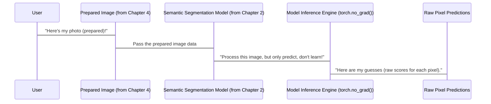

# Chapter 3: Model Inference Engine

Welcome back, future segmentation experts! In [Chapter 2: Semantic Segmentation Model](02_semantic_segmentation_model_.md), we got to know our "AI artist" – the powerful DeepLabV3 or FCN model, ready and pre-trained to understand images pixel by pixel. We learned that this artist's job is to extract features and then provide a "score" for every pixel, indicating what object it *might* be.

Today, we're going to dive into the exciting moment when we actually **ask** our AI artist to *do* something: to look at a brand-new picture and make its predictions. This crucial step is what we call the **Model Inference Engine**.

### What Problem Does the "Inference Engine" Solve?

Imagine you've hired a famous artist (our pre-trained Deep Learning Model) who specializes in painting beautiful landscapes. You've seen their past work, you know they're talented, and now you want them to paint *your* garden. You wouldn't expect them to go back to art school; you'd just give them a photo and say, "Please paint this for me!"

The **Model Inference Engine** is precisely that process: it's how we feed a prepared image to our "AI artist" model and instantly get its creative "predictions" or "guesses." It's about *using* the model's learned knowledge, not *teaching* it anything new.

### Key Concepts of the "Inference Engine"

Let's break down the core ideas behind this process:

1.  **Inference (Making a Guess):** This is the main goal. It's the act of the model processing new data (your image) and producing an output (its predictions) based on what it has already learned. It's like the artist quickly sketching your garden based on their immense experience.

2.  **No New Learning (`torch.no_grad()`):** When we're doing inference, we don't want the model to change its learned "style" or "knowledge." We want it to use what it already knows, without trying to learn anything new from *this* specific image. The `torch.no_grad()` part tells our deep learning framework (PyTorch) to essentially "turn off the learning brain" and just focus on applying its existing knowledge very, very quickly. This saves memory and speeds up the prediction process.

3.  **Raw Scores/Probabilities:** The model doesn't directly output a colorful, final segmentation mask. Instead, for every single pixel in your image, it outputs a list of numbers. Each number represents how confident the model is that this pixel belongs to a specific object class (e.g., a high number for 'cat' and a low number for 'sofa' if the pixel is part of a cat). These are the "raw scores" or "probabilities."

### How We Use the Inference Engine in Our Project

In our `main.py` script, after we've prepared our image (which you'll learn about in [Image Preprocessing Pipeline](04_image_preprocessing_pipeline_.md)) and loaded our segmentation model ([Semantic Segmentation Model](02_semantic_segmentation_model_.md)), the very next step is to run the inference.

Here's the key snippet from `main.py`:

```python
import torch

# ... (input_tensor is your prepared image, model is your loaded AI artist) ...

# Ask the model to make predictions using our prepared image
with torch.no_grad(): # We don't need to learn anything new, just predict!
    output = model(input_tensor)["out"][0]
```

**What happened here?**

1.  `with torch.no_grad():`: This block of code ensures that our model operates in "prediction mode" only. It won't update its internal weights or try to learn anything, making the process faster and more efficient.
2.  `output = model(input_tensor)`: This is where the magic happens! We feed our `input_tensor` (the digital, prepared version of your image) directly into our `model`. The `model` then crunches the numbers, running the image through all its learned layers, just like our AI artist quickly paints a new picture based on a photo.
3.  `["out"][0]`: Deep learning models often have complex outputs. This part simply extracts the *main* prediction output from our specific segmentation model. Think of it as opening a package from the artist and taking out the actual painting, ignoring any packing peanuts or instructions.

The `output` variable now holds the raw scores or probabilities for every single pixel in your image, telling us how likely each pixel is to belong to 'background', 'car', 'person', etc.

### Inside the "Inference Engine": A Conceptual Walkthrough

Let's trace the journey of our prepared image through the inference engine with our "AI artist" analogy:



**Step-by-Step:**

1.  **Image is Ready:** You provide an image, and it goes through the [Image Preprocessing Pipeline](04_image_preprocessing_pipeline_.md) to become the `input_tensor`. This is your neatly framed photograph ready for the artist.
2.  **Meet the Artist:** The `input_tensor` is then presented to our `model` (the [Semantic Segmentation Model](02_semantic_segmentation_model_.md)).
3.  **The Artist at Work (Inference):** The `with torch.no_grad():` block sets the stage. The model quickly runs the `input_tensor` through its internal layers, applying all the patterns and features it learned during its training. It's like the artist using their trained eye and skilled hand to reproduce what they see in your photo.
4.  **Raw Predictions:** The model's final job is to produce a grid of numbers, one for each pixel. For every pixel, it assigns a set of scores – one score for 'background', one for 'car', one for 'person', and so on. These are the `output` we get.

### Conclusion

The Model Inference Engine is the bridge between our powerful, pre-trained "AI artist" and getting actual, usable predictions for a new image. It’s the process where the model applies its learned knowledge without further training, generating raw scores for every pixel. These raw scores are the foundation for building our final, beautiful segmentation mask.

But what do we do with these raw scores? How do we turn a bunch of numbers into a clear, visual map of objects? That's exactly what we'll explore in the next chapter: [Segmentation Mask Generation](05_segmentation_mask_generation_.md).

---

Generated by [AI Codebase Knowledge Builder](https://github.com/The-Pocket/Tutorial-Codebase-Knowledge)