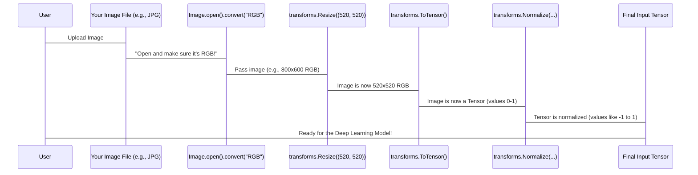

# Chapter 4: Image Preprocessing Pipeline

Welcome back, segmentation enthusiasts! In our previous chapters, especially in [Chapter 3: Model Inference Engine](03_model_inference_engine_.md), we saw how our powerful "AI artist" (the deep learning model) is ready to make predictions once it receives a *prepared* image. But what exactly does "prepared" mean?

That's precisely what we'll uncover today! This chapter is all about the **Image Preprocessing Pipeline**, the crucial first step to get your images ready for the AI.

### What Problem Does Our "Kitchen Chef" Solve?

Imagine you're a kitchen chef preparing ingredients for a very specific, gourmet recipe. The recipe doesn't just say "use vegetables"; it specifies "finely diced carrots, peeled and sliced potatoes, and seasoned broccoli florets." You can't just throw whole, muddy vegetables into the pot! You need to clean, chop, and prepare them exactly as the recipe demands.

Our deep learning model is just like that gourmet recipe. It expects its "ingredients" (your raw images) in a very particular, standardized format. It doesn't understand raw, pixel-by-pixel information directly from your camera. It needs the images to be:

1.  **The right size:** All images must be the same dimensions.
2.  **In a numerical language:** Images must be converted into numbers that computers can process.
3.  **Standardized:** Colors and brightness levels need to be adjusted to a common range, much like seasoning vegetables consistently.

The **Image Preprocessing Pipeline** is our "kitchen chef." Its job is to take your raw images and transform them into this standardized, AI-friendly format. This ensures that the deep learning model receives the input it expects, similar to how a recipe requires ingredients in a particular form for the best outcome. It's the first crucial step to make the image "understandable" by the AI.

### Key Steps in Our Preprocessing Kitchen

Our preprocessing pipeline involves a few essential "chef's tasks" to get the image just right:

1.  **Resizing (Chopping to Size):**
    *   **Why?** Deep learning models are designed to work with inputs of a fixed size. If you feed images of different sizes, the model will get confused.
    *   **How?** We resize all images to a consistent `520x520` pixels. This makes sure every image, whether it was originally tiny or huge, presents itself to the model as a uniform `520x520` grid.

2.  **Converting to Numbers (Counting Ingredients):**
    *   **Why?** Computers don't "see" images in the human sense. They understand numbers. An image is just a grid of pixels, and each pixel has color information (e.g., Red, Green, Blue values). These need to be represented as numerical values.
    *   **How?** We convert the image into a special data structure called a **Tensor**. Think of a tensor as a multi-dimensional array or a grid of numbers. For an image, it typically becomes a 3D grid: Height x Width x Color Channels (e.g., 3 for RGB).

3.  **Normalization (Consistent Seasoning):**
    *   **Why?** The lighting conditions or camera settings can vary wildly between images. One image might be bright, another dim. If the model sees wildly different brightness or color ranges, it might struggle to learn. Normalization adjusts the pixel values to a standard range (e.g., between -1 and 1, or 0 and 1 with a specific mean and standard deviation).
    *   **How?** We use predefined `mean` and `standard deviation (std)` values. These values are typically calculated from very large datasets that the model was originally trained on (like ImageNet). Applying them makes our image "look" consistent to the model, regardless of its original lighting.

### How to Use the Preprocessing Pipeline

Let's look at how we perform these steps in our `main.py` script. We use a powerful library called `torchvision.transforms` which provides ready-made "chef's tools" for these tasks.

First, we load our raw image:

```python
from PIL import Image

# Imagine 'img_path' is where your uploaded image is stored
input_image = Image.open(img_path).convert("RGB")
```
**What happened?** We used the `PIL` (Pillow) library to open the image from its path. `.convert("RGB")` ensures that even if your image was in grayscale, it's converted to a standard 3-channel (Red, Green, Blue) color format, which our model expects.

Next, we define our pipeline of "chef's instructions":

```python
from torchvision import transforms

preprocess = transforms.Compose([
    transforms.Resize((520, 520)), # Step 1: Make all images 520x520 pixels
    transforms.ToTensor(),         # Step 2: Convert image to numbers (tensor)
    transforms.Normalize(mean=[0.485, 0.456, 0.406],
                         std=[0.229, 0.224, 0.225]), # Step 3: Normalize colors
])
```
**What happened?**
*   `transforms.Compose`: This is like a list of instructions for our chef. It says, "Do these things in this order."
*   `transforms.Resize((520, 520))`: Our first instruction: shrink or enlarge the image to exactly `520` pixels wide and `520` pixels tall.
*   `transforms.ToTensor()`: Our second instruction: convert the image from a PIL Image format into a `torch.Tensor` (a numerical array). It also automatically scales pixel values from 0-255 to 0-1.
*   `transforms.Normalize(...)`: Our third instruction: adjust the brightness and color balance using specific `mean` and `std` values that the model expects. This is crucial because our model was trained on images processed with these exact values.

Finally, we apply these instructions to our `input_image`:

```python
input_tensor = preprocess(input_image).unsqueeze(0) # Apply the cleaning steps
```
**What happened?**
*   `preprocess(input_image)`: We feed our raw image into our defined `preprocess` pipeline. All the steps (resize, to_tensor, normalize) are applied one after the other.
*   `.unsqueeze(0)`: This is a small but important step. Our model is designed to process not just one image, but a *batch* of images at a time (even if our batch only has one image). `unsqueeze(0)` simply adds an extra dimension at the beginning, indicating that there's "one image in this batch."

The `input_tensor` is now the perfectly "prepared ingredient" for our deep learning model!

### Inside the "Preprocessing Kitchen": A Conceptual Walkthrough

Let's visualize the journey of your image through this pipeline:



**Step-by-Step:**

1.  **Raw Image:** You upload a photograph, which is a file on your computer.
2.  **Open and Convert:** The `Image.open().convert("RGB")` step loads the image into memory and ensures it's in a consistent 3-channel color format.
3.  **Resize:** The `transforms.Resize` step mathematically scales the image pixels. If it's too big, pixels are merged; if too small, they are duplicated/interpolated to fit the 520x520 frame.
4.  **To Tensor:** The `transforms.ToTensor` step converts the image's pixel grid into a numerical PyTorch tensor. It also automatically changes the range of pixel values from 0-255 (standard image range) to 0-1 (a common range for deep learning).
5.  **Normalize:** The `transforms.Normalize` step then takes these 0-1 values and shifts/scales them using the `mean` and `std` values. This results in pixel values that often span a range like -1 to 1 or similar, aligning them with how the model expects its input.
6.  **Add Batch Dimension:** Finally, the `.unsqueeze(0)` adds the batch dimension, making the tensor ready to be fed into the deep learning model.

### Conclusion

The Image Preprocessing Pipeline is like the invisible but indispensable work done by a chef before cooking begins. It transforms your raw images into a standardized, numerical format that our deep learning model can understand and process effectively. Without this crucial step, the model would not be able to learn from or make predictions on your images.

Now that our image is perfectly prepared, we're ready to see how the model takes this prepared input and generates its first set of predictions. Let's move on to [Chapter 5: Segmentation Mask Generation](05_image_preprocessing_pipeline_.md), where we'll turn the model's raw outputs into a clear and actionable segmentation map!

---

Generated by [AI Codebase Knowledge Builder](https://github.com/The-Pocket/Tutorial-Codebase-Knowledge)