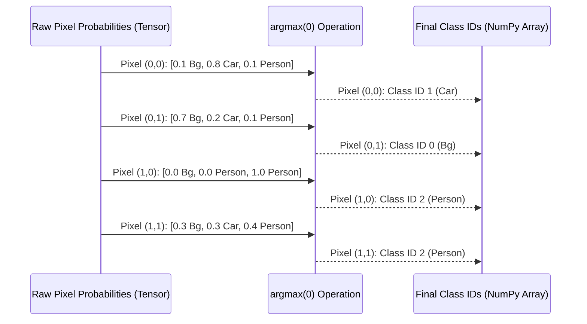

# Chapter 5: Segmentation Mask Generation

Welcome back, digital artists! In our journey so far, we've prepared our image beautifully in [Chapter 4: Image Preprocessing Pipeline](04_image_preprocessing_pipeline_.md) and then fed it to our powerful "AI artist" model, which gave us raw predictions through the [Model Inference Engine](03_model_inference_engine_.md).

But what exactly are these "raw predictions"? Imagine your AI artist doesn't just paint a picture, but instead gives you a list of "probabilities" for every tiny spot on the canvas: "This spot is 80% likely to be blue, 15% green, 5% red." This is great information, but it's not a clear, finished painting yet. We need to turn these fuzzy probabilities into a definitive decision for every single spot!

### What Problem Does Our "Decision Maker" Solve?

Think of our model's raw predictions as a **"fuzzy voting result"** for every pixel. For a pixel in the middle of a car, the model might say:
*   "Probability of being 'car': 80%"
*   "Probability of being 'road': 15%"
*   "Probability of being 'person': 5%"
*   ...and so on for all possible object classes.

While this is very informative, we need a single, clear answer for each pixel to create a proper segmentation map. We can't have a pixel that's "80% car and 15% road" in our final picture. It has to be *one thing or the other*.

The **Segmentation Mask Generation** step is like a "definitive decision-maker." For every pixel, it looks at all the probabilities and simply picks the class that has the **highest** probability. This transforms the model's fuzzy votes into a sharp, clear segmentation mask where every single pixel is definitively assigned to one specific object class. The result is a simple map where each pixel's value is just a number representing its assigned object class (e.g., '0' for background, '7' for car, '15' for person).

### The "Decision Maker" in Detail: Choosing the Winner

The core idea here is incredibly simple: **"The winner takes it all."**

1.  **Input:** For each pixel, we receive a list of probability scores from the model. Each score corresponds to how likely that pixel is to belong to a specific object class.
2.  **Comparison:** We compare all the scores for that single pixel.
3.  **Selection:** We pick the class that has the highest score.
4.  **Output:** The class ID (a number) of the winning class becomes the definitive label for that pixel.

This process is repeated for *every single pixel* in the image, resulting in a new image (or map) where each pixel's value is now a clear, unambiguous class ID. This is our raw **segmentation mask**.

### How to Use Our "Decision Maker"

In our `main.py` script, after the [Model Inference Engine](03_model_inference_engine_.md) has produced its `output` (the raw class probabilities), the very next step is to generate this clear segmentation mask.

Here's the key snippet from `main.py`:

```python
import torch # Needed for output, which is a torch.Tensor
import numpy as np # Needed for the final mask, often converted to numpy

# ... (output is the raw probabilities from the model) ...

# For each pixel, pick the class with the highest score
pred = output.argmax(0).byte().cpu().numpy()
```
**What happened here?**

1.  `output`: This variable holds the raw predictions from our deep learning model. It's a special type of data structure called a "tensor" in PyTorch. For each pixel, it contains a list of scores for all possible object classes. Imagine its shape like `[Number_of_Classes, Height, Width]`.
2.  `.argmax(0)`: This is the crucial "decision-maker" part!
    *   `argmax` stands for "argument of the maximum." It means, "give me the *index* (position) of the largest value."
    *   The `0` tells `argmax` to look for the maximum value along the *first* dimension (which is where our class probabilities are stored).
    *   So, for every pixel, `argmax(0)` finds which class (by its index, e.g., 0 for 'background', 7 for 'car') has the highest probability.
    *   The result is a new tensor where each pixel now has a single number representing its chosen class ID. Its shape is now `[Height, Width]`.
3.  `.byte()`: This converts the numbers in our `pred` tensor to a `byte` data type (which means unsigned integers, typically 0-255). This is a memory-efficient way to store class IDs, as we usually don't have hundreds of classes.
4.  `.cpu()`: If you're using a powerful graphics card (GPU) for computations, the `output` tensor might be on the GPU. `.cpu()` simply moves it back to your computer's main memory (CPU) so it can be used by other parts of your program.
5.  `.numpy()`: Finally, this converts the PyTorch tensor into a NumPy array. NumPy arrays are standard for numerical operations in Python and are easy to work with for image processing and visualization.

The `pred` variable now holds our beautifully generated segmentation mask! It's a 2D grid of numbers, where each number is the definitive class ID for that pixel.

### Inside the "Decision Maker": A Conceptual Walkthrough

Let's visualize how the `argmax` operation works pixel by pixel:

Imagine a tiny 2x2 image, and our model predicts probabilities for 3 classes (e.g., Background, Car, Person).



**Step-by-Step:**

1.  **Model Output (`output`):** The model gives us a grid of numbers. For our example, for each pixel, we have three probabilities.
    *   Pixel (0,0) (top-left): `[0.1, 0.8, 0.1]` (Class 0, Class 1, Class 2)
    *   Pixel (0,1) (top-right): `[0.7, 0.2, 0.1]`
    *   Pixel (1,0) (bottom-left): `[0.0, 0.0, 1.0]`
    *   Pixel (1,1) (bottom-right): `[0.3, 0.3, 0.4]`
2.  **The `argmax(0)` Operation:** Our "decision maker" now goes to each pixel's list:
    *   For Pixel (0,0): The highest probability is `0.8`, which is at index `1`. So, this pixel is assigned Class ID `1`.
    *   For Pixel (0,1): The highest probability is `0.7`, which is at index `0`. So, this pixel is assigned Class ID `0`.
    *   For Pixel (1,0): The highest probability is `1.0`, which is at index `2`. So, this pixel is assigned Class ID `2`.
    *   For Pixel (1,1): The highest probability is `0.4`, which is at index `2`. So, this pixel is assigned Class ID `2`.
3.  **Resulting Segmentation Mask (`pred`):** We now have a clean map of class IDs:
    ```
    [[1, 0],
     [2, 2]]
    ```
    This `pred` array is the precise segmentation mask, ready to be understood by humans.

This seemingly simple operation is what converts the complex output of a deep learning model into a clear, pixel-by-pixel map of object classifications.

### Conclusion

The Segmentation Mask Generation step is a vital bridge that transforms the nuanced, probabilistic predictions of our deep learning model into clear, definitive statements about what object each pixel belongs to. By simply picking the most confident prediction for every pixel, we create a crisp, numerical map that precisely outlines all detected objects.

But a map of numbers isn't very helpful for humans! We need to know what `0` means, what `1` means, and how to make these numbers visually appealing. In the next chapter, [Class Definition and Coloring](06_class_definition_and_coloring_.md), we'll learn how to assign meaningful names and beautiful colors to these class IDs, finally bringing our segmentation mask to life!

---

Generated by [AI Codebase Knowledge Builder](https://github.com/The-Pocket/Tutorial-Codebase-Knowledge)