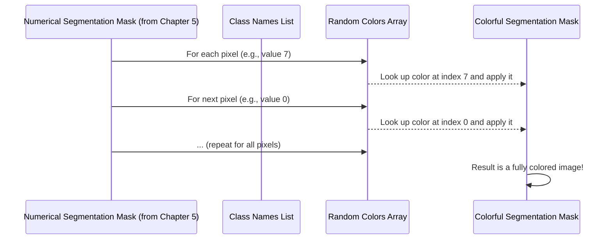

# Chapter 6: Class Definition and Coloring

Welcome back, future image segmentation experts! In our last chapter, [Chapter 5: Segmentation Mask Generation](05_segmentation_mask_generation_.md), we saw how our "AI artist" transformed its raw, fuzzy predictions into a clear-cut numerical map, which we called the `pred` array. This array tells us, pixel by pixel, "this pixel is class 0," "that pixel is class 7," and so on.

But what do "class 0" or "class 7" actually *mean*? If you look at that `pred` array on its own, it's just a grid of numbers. To us humans, it's still pretty abstract! We need to know: Is class 7 a 'car'? Is class 15 a 'person'? And wouldn't it be much easier to understand if all cars were, say, blue, and all people were green?

### What Problem Does Our "Legend and Color Palette" Solve?

Imagine you're looking at a treasure map that has different shaded areas, but no legend to tell you what the shades mean. Is the red area the "dangerous lava pit" or the "delicious pizza stand"? You wouldn't know!

Our **Class Definition and Coloring** step acts as the crucial "legend" and "color palette" for our segmentation results. Its job is twofold:

1.  **Define Classes:** It gives human-readable names to those numerical class IDs (e.g., mapping `7` to 'car', `15` to 'person', `0` to 'background'). This creates our segmentation map's "legend."
2.  **Assign Colors:** It assigns a unique, distinct color to each of these defined classes. This is our "color palette."

By doing this, when we display the segmentation mask, users can instantly understand which color corresponds to which detected object. It transforms a numerical map into a colorful, easy-to-interpret visual output!

### Key Concepts: Naming and Painting Our Objects

Let's break down these two essential tasks:

1.  **Class Definition (The Legend):**
    *   Our deep learning model is trained to recognize 20 specific object categories from a dataset called PASCAL VOC, plus one for 'background'. That makes 21 possible things it can find.
    *   This concept involves creating a simple list where each position in the list corresponds to a class ID. So, the item at index `0` is 'background', index `1` is 'aeroplane', index `7` is 'car', and so on.
    *   This list becomes our definitive reference for what each number in our `pred` array actually represents.

2.  **Coloring (The Palette):**
    *   Once we know the names, we need to make them visible. We assign a different, visually distinct color to each class.
    *   We want these colors to be unique so that 'car' isn't the same color as 'person', preventing confusion.
    *   For simplicity and variety, we often generate these colors randomly. However, we use a trick (`np.random.seed(42)`) to ensure that every time you run the program, the same class always gets the same random color. This makes your results consistent and predictable.

### How to Use Our "Legend and Color Palette"

Let's see how these ideas are put into practice in our `main.py` script, immediately after generating our numerical `pred` array from [Chapter 5: Segmentation Mask Generation](05_segmentation_mask_generation_.md).

First, we define our class names:

```python
# Define COCO/VOC Classes
VOC_CLASSES = [
    'background', 'aeroplane', 'bicycle', 'bird', 'boat',
    'bottle', 'bus', 'car', 'cat', 'chair',
    'cow', 'dining table', 'dog', 'horse', 'motorbike',
    'person', 'potted plant', 'sheep', 'sofa', 'train',
    'tv/monitor'
]
```
**What happened?**
We created a list called `VOC_CLASSES`. Each word in this list is the human-readable name for an object category. The position of the word in the list is its class ID. For example, `VOC_CLASSES[0]` is 'background', `VOC_CLASSES[7]` is 'car', and `VOC_CLASSES[15]` is 'person'. This is our "legend."

Next, we generate our unique colors for each class:

```python
import numpy as np # Make sure numpy is imported if not already

# Random color map for classes
np.random.seed(42) # For consistent colors each time you run the code
colors = np.random.randint(0, 255, size=(len(VOC_CLASSES), 3), dtype=np.uint8)
```
**What happened?**
*   `np.random.seed(42)`: This line is important for reproducibility. It ensures that the "random" colors generated are the *same* every time you run the program. If you removed this, 'car' might be blue one run and red the next!
*   `np.random.randint(0, 255, size=(len(VOC_CLASSES), 3), dtype=np.uint8)`: This is where we create our "color palette."
    *   `len(VOC_CLASSES)`: This tells us how many classes we have (21).
    *   `size=(..., 3)`: For each of the 21 classes, we need 3 numbers (for Red, Green, and Blue color components).
    *   `randint(0, 255)`: Each of these 3 numbers will be a random integer between 0 and 255 (the standard range for color values).
    *   `dtype=np.uint8`: This specifies that the numbers should be stored as 8-bit unsigned integers, which is common for color values.
The `colors` variable is now a 2D array. If you imagined it, it would look like `[[R0, G0, B0], [R1, G1, B1], ..., [R20, G20, B20]]`, where each inner list `[R, G, B]` is a unique color for a specific class ID.

Finally, we apply these colors to our numerical segmentation mask:

```python
# Overlay Segmentation Mask on Original Image (This section is simplified for this chapter)
mask_color = colors[pred]  # Apply colors to our numerical mask
# ... (rest of the visualization code, covered in Chapter 7) ...
```
**What happened?**
*   `pred`: This is our numerical segmentation mask from [Chapter 5: Segmentation Mask Generation](05_segmentation_mask_generation_.md). It's a 2D array where each pixel contains a number from `0` to `20` (our class IDs).
*   `colors[pred]`: This is a very powerful NumPy trick called "fancy indexing." For every number (class ID) in our `pred` array, NumPy goes to the `colors` array and picks out the corresponding `[R, G, B]` color.
    *   So, if a pixel in `pred` has the value `7` (for 'car'), `colors[pred]` will replace that `7` with the `[R, G, B]` color assigned to class `7`.
    *   If a pixel has `15` (for 'person'), it gets the `[R, G, B]` color for class `15`.
*   The result, `mask_color`, is now a beautiful, colorful image! Instead of numbers, each pixel now contains its assigned `[R, G, B]` color.

### Inside the "Legend and Color Palette": A Conceptual Walkthrough

Let's trace how our numerical `pred` array becomes a vibrant `mask_color` image:



**Step-by-Step:**

1.  **Numerical `pred` Array:** We start with our `pred` array, which is an image-sized grid where each pixel holds a number (0-20) representing its detected object class.
2.  **`VOC_CLASSES` (The Legend):** This list stands ready to tell us what each number means. While not directly used in the `mask_color` creation itself, it's essential for displaying the human-readable names later.
3.  **`colors` Array (The Palette):** This array holds a unique `[R, G, B]` color for each class ID. `colors[0]` is the color for 'background', `colors[1]` for 'aeroplane', `colors[7]` for 'car', and so on.
4.  **Applying Colors:** When we perform `mask_color = colors[pred]`, the system effectively iterates through every pixel in `pred`:
    *   It takes the class ID from that pixel (e.g., `7`).
    *   It uses this ID as an index to fetch the corresponding color from the `colors` array (`colors[7]`).
    *   It then places this `[R, G, B]` color into the same pixel location in the new `mask_color` image.
5.  **Colorful `mask_color`:** After processing all pixels, `mask_color` becomes a visually rich image where each object region is filled with its assigned, distinct color.

This `mask_color` image is now perfectly ready to be combined with our original input image for a clear and insightful visualization!

### Conclusion

The "Class Definition and Coloring" step is what breathes visual life into our numerical segmentation masks. By defining human-readable names for our object classes and assigning a unique color to each, we transform an abstract grid of numbers into an intuitive, colorful map that clearly shows what our deep learning model has detected. It's the essential bridge that makes our AI's powerful "vision" understandable to us.

Now that we have our beautiful `mask_color` image, we're ready for the grand finale: displaying all our hard work! In the next chapter, [Chapter 7: Results Visualization](07_results_visualization_.md), we'll learn how to present the original image, the raw mask, and an elegant overlay to fully showcase our segmentation results.

---

Generated by [AI Codebase Knowledge Builder](https://github.com/The-Pocket/Tutorial-Codebase-Knowledge)