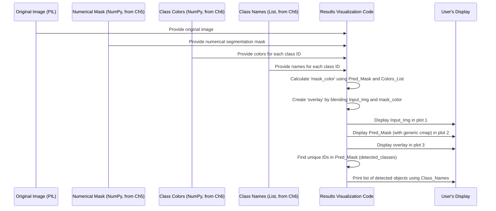

# Chapter 7: Results Visualization

Welcome to the grand finale of our image segmentation journey! In our previous chapter, [Chapter 6: Class Definition and Coloring](06_class_definition_and_coloring_.md), we learned how to give meaningful names to our detected objects and assign a beautiful, distinct color to each. We now have a colorful segmentation mask (`mask_color`) that clearly shows where each object is.

But what's the point of creating such a masterpiece if you can't proudly display it? This chapter is all about setting up our very own "art gallery" – the **Results Visualization** step.

### What Problem Does Our "Art Gallery" Solve?

Imagine you've painted a beautiful picture (your original image), and then, using a clear overlay, you've perfectly outlined all the different elements in it with vibrant colors (your `mask_color`). You also have a simpler map that just uses numbers for each object (your `pred` array).

The problem is: how do you show all these pieces of information together in a way that's easy to understand, compare, and appreciate? You want to see:

1.  **The Original:** What did the input image look like?
2.  **The Raw Segmentation:** What did the model *purely* classify, pixel by pixel (without the original image distracting)?
3.  **The Overlay:** How well does the segmentation blend with the real-world objects?

The **Results Visualization** step solves this by arranging all these elements side-by-side in a single, clear plot. It allows you to easily inspect the model's output, see exactly what objects were detected, and appreciate the segmentation in the context of the actual image. It's like having a curator present your model's work in the best possible light!

### Key Concepts for Our "Art Gallery" Display

To create our impressive display, we'll focus on these key ideas:

1.  **Original Input Image:** The image you fed into the system. It's the "before" picture.
2.  **Segmentation Mask (Raw IDs):** The numerical `pred` array from [Chapter 5: Segmentation Mask Generation](05_segmentation_mask_generation_.md). Displaying this directly with a generic color map can show the distinct regions clearly.
3.  **Colorful Segmentation Mask:** The `mask_color` image from [Chapter 6: Class Definition and Coloring](06_class_definition_and_coloring_.md). This is a pure colored map of the detected objects.
4.  **The Overlay (Blended View):** This is a new, crucial element! We'll combine our colorful segmentation mask with the original image, making the mask slightly transparent. This lets you see the original image *and* the segmentation on top of it at the same time.
5.  **Side-by-Side Plotting:** Using a tool like `matplotlib` to arrange these images next to each other for easy comparison.
6.  **Detected Classes List:** A simple text list showing *which* specific objects (e.g., 'car', 'person') were actually found in *this* particular image.

### How to Create Our "Art Gallery" Display

We'll use Python's powerful `matplotlib` library to create our visualizations. We've already got our `input_image` (the original), our `pred` (numerical mask), our `mask_color` (colorful mask), and our `VOC_CLASSES` (class names list) ready!

#### 1. Creating the "Overlay" Image

The overlay is arguably the most visually informative part. It combines the original image with our colorful segmentation mask, usually with some transparency so you can still see the original details underneath.

```python
import numpy as np # Ensure numpy is imported
from PIL import Image # Ensure PIL is imported

# ... (input_image and mask_color are already prepared) ...

# Create an image that blends the original picture with the colorful mask
overlay = (0.5 * np.array(input_image.resize((520,520))) + 0.5 * mask_color).astype(np.uint8)
```
**What happened?**
1.  `np.array(input_image.resize((520,520)))`: We first convert our `input_image` into a NumPy array, which is a format `numpy` can perform calculations on. Crucially, `input_image.resize((520,520))` makes sure it's the exact same size as our `mask_color` (which is `520x520` from earlier steps), so they can be perfectly aligned.
2.  `0.5 * ...`: We multiply both the (resized) original image and the `mask_color` by `0.5`. This is how we achieve transparency! Each image contributes half of its brightness/color to the final `overlay`.
3.  `+`: We then add these two partially transparent images together.
4.  `.astype(np.uint8)`: Finally, we convert the resulting pixel values back to `uint8` (unsigned 8-bit integers), which means values between 0 and 255. This is the standard format for image pixels.

The `overlay` variable now holds a beautiful image where the original scene is subtly visible, with our colorful segmentation proudly displayed on top!

#### 2. Displaying All Three Images Side-by-Side

Now, let's use `matplotlib` to plot our original image, the raw segmentation mask, and the new overlay.

```python
import matplotlib.pyplot as plt # Ensure matplotlib is imported

# ... (input_image, pred, and overlay are ready) ...

plt.figure(figsize=(15,8)) # Create a large figure to hold our images

# Subplot 1: Original Image
plt.subplot(1,3,1) # (1 row, 3 columns, 1st plot)
plt.imshow(input_image)
plt.title("Original Image")
plt.axis("off") # Hide the x and y axis labels

# Subplot 2: Raw Segmentation Mask (using numerical pred)
plt.subplot(1,3,2) # (1 row, 3 columns, 2nd plot)
plt.imshow(pred, cmap="tab20b") # 'pred' contains numerical IDs. 'tab20b' is a default colormap.
plt.title("Segmentation Mask")
plt.axis("off")

# Subplot 3: Overlay (Segmentation + Image)
plt.subplot(1,3,3) # (1 row, 3 columns, 3rd plot)
plt.imshow(overlay)
plt.title("Overlay (Segmentation + Image)")
plt.axis("off")

plt.show() # Show the entire figure with all plots!
```
**What happened?**
1.  `plt.figure(figsize=(15,8))`: We create a large container for our plots, specifying its width and height in inches.
2.  `plt.subplot(1,3,1)`: This command tells `matplotlib` that we want to arrange our plots in 1 row and 3 columns, and we are currently working on the *first* plot.
3.  `plt.imshow(input_image)`: This displays our original image in the current plot.
4.  `plt.title("Original Image")`: We give this plot a clear title.
5.  `plt.axis("off")`: This removes the numerical x and y axis labels, keeping our display clean.
6.  The same steps are repeated for the `pred` (raw mask) and `overlay` images, placing them in the second and third positions in our 1x3 grid.
    *   For `pred`, we use `cmap="tab20b"`. This tells `matplotlib` to use a specific color map to automatically color the numerical class IDs in `pred` for display. It's different from our custom `mask_color`, showing the pure numerical output.
7.  `plt.show()`: This command finally displays the entire figure with all three images.

You will now see a beautiful arrangement: your original image on the left, the raw segmentation mask in the middle (showing distinct colored blobs), and the elegant overlay on the right!

#### 3. Listing the Detected Classes

To make the results even clearer, it's helpful to list which specific objects were found in the image.

```python
# ... (pred and VOC_CLASSES are ready) ...

detected_classes = np.unique(pred) # Find all unique class IDs present in the mask
print("✅ Detected Classes in Image:")
for c in detected_classes:
    print(f" - {VOC_CLASSES[c]}") # Print the human-readable name for each detected ID
```
**What happened?**
1.  `np.unique(pred)`: This powerful NumPy function looks at our entire `pred` array (the numerical segmentation mask) and finds all the *unique* class IDs present in it. For example, if the image has cars and people, `detected_classes` might be `[0, 7, 15]` (for background, car, person).
2.  We then loop through these unique IDs. For each ID `c`, we use `VOC_CLASSES[c]` to look up its human-readable name from our defined list and print it.

This provides a clear summary of all the objects our model successfully identified in your image!

### Inside the "Art Gallery": A Conceptual Walkthrough

Let's trace how all the pieces come together for our final display:



**Step-by-Step:**

1.  **Inputs are Ready:** We start with the `input_image`, the `pred` (numerical mask), the `colors` array, and the `VOC_CLASSES` list, all prepared from previous steps.
2.  **Colorful Mask Creation (Review from Ch6):** Although not explicitly shown as a step above, `mask_color = colors[pred]` is used behind the scenes to create the full-color mask before the overlay.
3.  **Overlay Calculation:** The `input_image` (resized to match) and the `mask_color` are combined mathematically to create the `overlay` image, blending them with 50% transparency.
4.  **Plotting:** `matplotlib` is then instructed to create a figure and divide it into three sections:
    *   The `input_image` is shown in the first section.
    *   The `pred` (numerical mask) is shown in the second section.
    *   The `overlay` is shown in the third section.
5.  **Axis Hiding & Titles:** For each plot, the axis labels are hidden, and a descriptive title is added.
6.  **Display:** All the plots are displayed together on your screen.
7.  **Class Listing:** Finally, the code identifies all *unique* class IDs present in the `pred` mask and then prints their human-readable names using the `VOC_CLASSES` list.

This entire process provides a comprehensive and easy-to-digest summary of our image segmentation model's performance!

### Conclusion

The Results Visualization chapter is where all our hard work comes to fruition! By carefully combining the original image, the raw segmentation mask, and a blended overlay, and by listing the detected classes, we create a clear and intuitive display of our deep learning model's output. This final "art gallery" allows anyone to easily understand what the model has "seen" and how it has segmented the image.

This marks the end of our beginner-friendly tutorial series on CNNs for Image Segmentation. You've now learned the entire pipeline, from preparing an image to understanding the model's brain, generating masks, coloring them, and finally, showcasing the amazing results! Congratulations on completing your journey into the exciting world of deep learning image segmentation!

---

Generated by [AI Codebase Knowledge Builder](https://github.com/The-Pocket/Tutorial-Codebase-Knowledge)