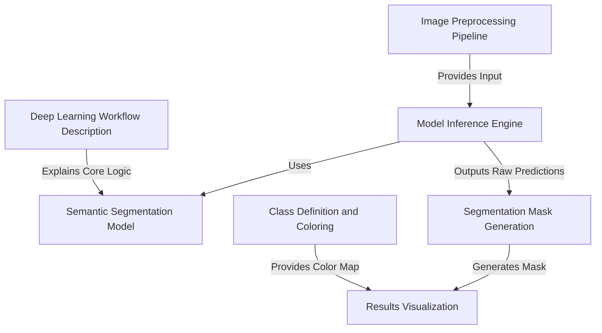

# Tutorial: CNNs-for-Image-Segmentation-using-U-Net-or-FCN-

This project is like an *intelligent digital artist* that can precisely **identify and outline** every object within an image, pixel by pixel. It takes an ordinary photo, processes it, and then uses a powerful pre-trained AI model to create a detailed map showing exactly where things like people, cars, or trees are located, finally displaying these *segmentation masks* clearly.

**Source Repository:** [https://github.com/PrathamPatil17/CNNs-for-Image-Segmentation-using-U-Net-or-FCN-](https://github.com/PrathamPatil17/CNNs-for-Image-Segmentation-using-U-Net-or-FCN-)

## Chapters

1. [Deep Learning Workflow Description
](01_deep_learning_workflow_description_.md)
2. [Semantic Segmentation Model
](02_semantic_segmentation_model_.md)
3. [Model Inference Engine
](03_model_inference_engine_.md)
4. [Image Preprocessing Pipeline
](04_image_preprocessing_pipeline_.md)
5. [Segmentation Mask Generation
](05_segmentation_mask_generation_.md)
6. [Class Definition and Coloring
](06_class_definition_and_coloring_.md)
7. [Results Visualization
](07_results_visualization_.md)

---

Generated by [AI Codebase Knowledge Builder](https://github.com/The-Pocket/Tutorial-Codebase-Knowledge)