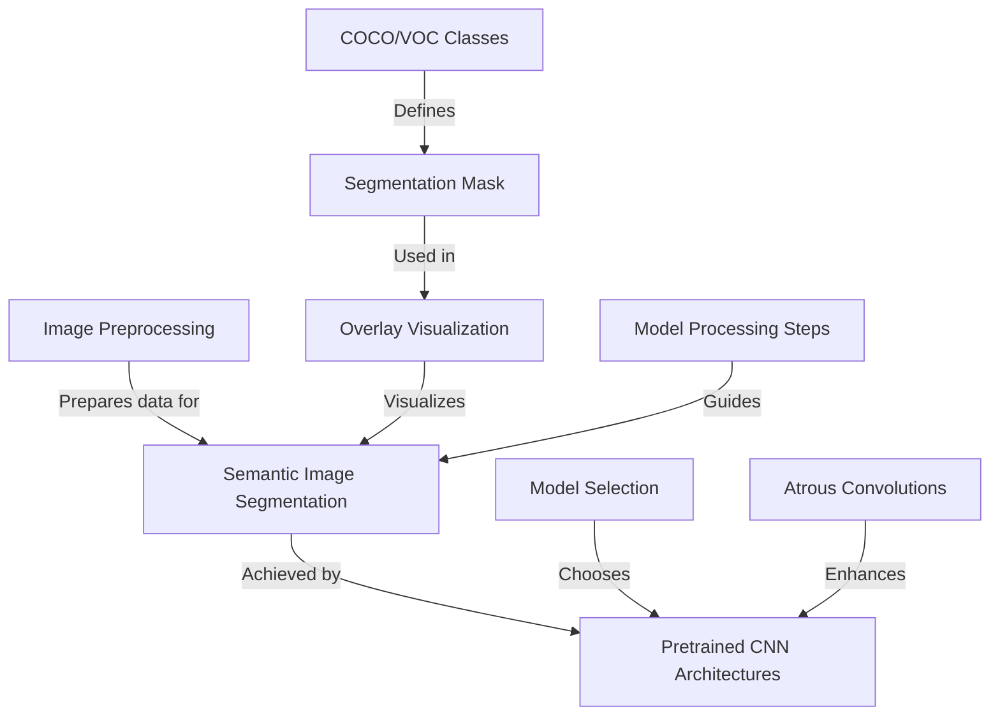

# Tutorial: CNNs-for-Image-Segmentation-using-U-Net-or-FCN-

This project focuses on **semantic image segmentation**, a technique that assigns labels to each pixel in an image, much like painting by numbers. It utilizes *pretrained CNN architectures* like U-Net, FCN, and DeepLabV3 to perform this task at a high level of detail. The goal is to achieve a deep understanding of image content by segmenting objects rather than just classifying them.

**Source Repository:** [https://github.com/PrathamPatil17/CNNs-for-Image-Segmentation-using-U-Net-or-FCN-](https://github.com/PrathamPatil17/CNNs-for-Image-Segmentation-using-U-Net-or-FCN-)

## Chapters

1. [Semantic Image Segmentation
](01_semantic_image_segmentation_.md)
2. [Image Preprocessing
](02_image_preprocessing_.md)
3. [COCO/VOC Classes
](03_coco_voc_classes_.md)
4. [Segmentation Mask
](04_segmentation_mask_.md)
5. [Overlay Visualization
](05_overlay_visualization_.md)
6. [Pretrained CNN Architectures
](06_pretrained_cnn_architectures_.md)
7. [Model Selection
](07_model_selection_.md)
8. [Atrous Convolutions
](08_atrous_convolutions_.md)
9. [Model Processing Steps
](09_model_processing_steps_.md)

---

Generated by [AI Codebase Knowledge Builder](https://github.com/The-Pocket/Tutorial-Codebase-Knowledge)