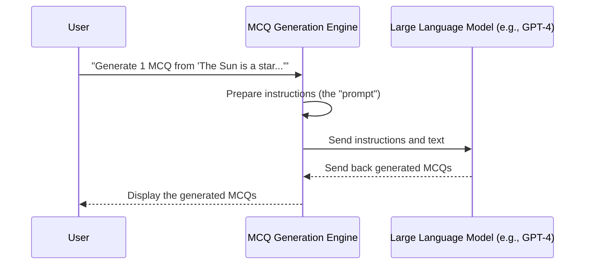

# Chapter 1: MCQ Generation Engine

Welcome to the exciting world of automatically generating quizzes! Imagine you have a textbook, and you need to create a multiple-choice quiz for a chapter. Instead of spending hours reading and writing questions, what if a super-intelligent tutor could do it for you instantly? That's exactly what the **MCQ Generation Engine** does in our project!

This chapter will introduce you to the "brain" of our application. It's the magical part that reads any text you give it and transforms it into multiple-choice questions (MCQs) complete with options and the correct answer.

## What Problem Does it Solve?

The main goal of the MCQ Generation Engine is to **automate the creation of quizzes**.
Think about it:
*   **Students:** Need practice questions for studying.
*   **Teachers:** Need to quickly generate quizzes or homework.
*   **Anyone learning:** Wants to test their understanding of a new topic.

Manually creating good quality MCQs is time-consuming and can be challenging. Our MCQ Generation Engine solves this by taking raw text (like a lecture note or a document) and, with the power of Artificial Intelligence, *instantly* creating relevant quiz questions for you.

## The Brain of the Operation: Large Language Models (LLMs)

At the heart of our MCQ Generation Engine is something called a **Large Language Model (LLM)**. You might have heard of them – think of tools like ChatGPT.

### What is an LLM?

An LLM is like an incredibly smart robot that has read a massive amount of text from the internet (books, articles, websites, etc.). Because of all this reading, it's very good at:
1.  **Understanding language:** It can comprehend what you're asking.
2.  **Generating language:** It can write new text that makes sense and follows your instructions.

In our project, we use an LLM as the "brain" of the MCQ Generation Engine. We give it instructions (a "prompt") and the text we want questions from, and it does the hard work of thinking up the quiz!

```python
# From app.py
from langchain_openai import ChatOpenAI

# This line sets up our "smart robot tutor" (the LLM)
model = ChatOpenAI(model_name="gpt-4-1106-preview", temperature=0)
```
This small piece of code initializes our `model`. We're telling our program to use a specific type of LLM (named "gpt-4-1106-preview") from OpenAI, and `temperature=0` means it will try to be as factual and consistent as possible when generating answers.

## How the Engine Works: Simple Steps

The MCQ Generation Engine takes two main things as input:
1.  The `input_text`: This is the content you want to create questions from (e.g., a paragraph about science).
2.  The `num_questions`: How many MCQs you want it to generate.

It then produces a neatly formatted list of MCQs, each with a question, four options, and the correct answer.

### Let's See It in Action (High-Level)

Imagine you have this short text:
"The Sun is a star. It is the center of our solar system and provides light and heat to Earth."

And you want 1 question.

You would "tell" the MCQ Generation Engine:
"Hey Engine, please read 'The Sun is a star. It is the center of our solar system and provides light and heat to Earth.' and give me 1 multiple-choice question from it."

The engine (using its LLM brain) would then think and might generate something like:

```
## MCQ
Question: What is the Sun?
A) A planet
B) A moon
C) A star
D) A comet
Correct Answer: C) A star
```

This is the core functionality. The engine takes your content and your request, and *poof*, out comes a quiz!

## Inside the MCQ Generation Engine: The `Question_mcqs_generator` Function

Let's look at the actual code that performs this magic. In our project, this is handled by a function called `Question_mcqs_generator` (you can find it in `app.py`).

### Step-by-Step Walkthrough

When you ask the MCQ Generation Engine for questions, here's what generally happens:



### The Code Behind the Magic

Let's dive into the `Question_mcqs_generator` function from `app.py`. Don't worry if it looks a bit long; we'll break it down.

```python
# From app.py

def Question_mcqs_generator(input_text, num_questions):
    # This is like giving specific instructions to our smart robot tutor.
    # We tell it what its role is, what text to use, how many questions to make,
    # and exactly how to format the questions and answers.
    prompt = f"""
    You are an AI assistant helping the user generate multiple-choice questions (MCQs) based on the following text:
    '{input_text}'
    Please generate {num_questions} MCQs from the text. Each question should have:
    - A clear question
    - Four answer options (labeled A, B, C, D)
    - The correct answer clearly indicated
    Format:
    ## MCQ
    Question: [question]
    A) [option A]
    B) [option B]
    C) [option C]
    D) [option D]
    Correct Answer: [correct option]
    """
    # We send our instructions (the prompt) to the LLM (our 'model').
    response = model.invoke(prompt)

    # The LLM gives us a response, which contains the generated MCQs.
    # .strip() just removes any extra spaces from the beginning or end.
    return response.content.strip()
```

Let's look at the key parts of this function:

1.  **`def Question_mcqs_generator(input_text, num_questions):`**
    *   This is how we define a function in Python. It's a block of code that does a specific task.
    *   `input_text` is the text you want questions from.
    *   `num_questions` is how many questions you want.

2.  **`prompt = f"""..."""`**
    *   This `prompt` is the most crucial part! It's like writing a detailed instruction manual for our LLM.
    *   The `f"""..."""` is a special way to create a multi-line text string in Python. The `f` before the quotes means we can easily include variables like `{input_text}` and `{num_questions}` directly inside the string.
    *   We clearly tell the LLM:
        *   What its role is ("You are an AI assistant...").
        *   The specific text it should use (`'{input_text}'`).
        *   How many questions to generate (`{num_questions}`).
        *   The exact format for each question, including options and the correct answer. This ensures consistency!

3.  **`response = model.invoke(prompt)`**
    *   This line is where the magic truly happens! We take our carefully crafted `prompt` (instructions) and send it to our `model` (the LLM).
    *   `model.invoke(prompt)` means "run the LLM with these instructions."
    *   The LLM processes the instructions and the text, then generates the MCQs and sends them back as a `response`.

4.  **`return response.content.strip()`**
    *   The `response` object contains various pieces of information, and `response.content` holds the actual text generated by the LLM (our MCQs!).
    *   `.strip()` is just a little helper that removes any extra blank spaces or lines from the beginning or end of the generated text, making it cleaner.
    *   Finally, the function returns these neatly formatted MCQs.

This `Question_mcqs_generator` function is the core of our MCQ Generation Engine. It's the part that translates your request and text into a conversation with a powerful AI, resulting in ready-to-use quizzes.

## Conclusion

In this chapter, we explored the **MCQ Generation Engine**, the "brain" of our application. We learned that it uses a **Large Language Model (LLM)** to understand text and generate multiple-choice questions based on specific instructions. We saw how a `prompt` guides the LLM to create questions with the desired format, turning any given text into an instant quiz.

This engine is powerful, but it's just one part of our complete application. Next, we'll look at how this engine fits into the overall structure and how users interact with it through a web interface.

Ready to see how all these pieces come together? Let's move on to the next chapter!

[Next Chapter: Web Application Core](02_web_application_core_.md)

---

Generated by [AI Codebase Knowledge Builder](https://github.com/The-Pocket/Tutorial-Codebase-Knowledge)