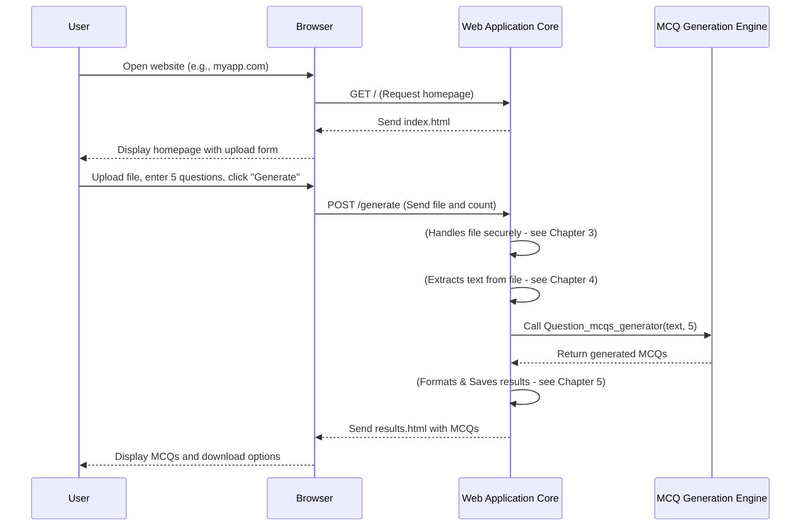

# Chapter 2: Web Application Core

Welcome back! In [Chapter 1: MCQ Generation Engine](01_mcq_generation_engine_.md), we explored the "brain" of our project – the part that magically turns text into multiple-choice questions using powerful AI. It's like having a super-smart tutor hidden away, ready to generate quizzes on demand.

But how do you actually *talk* to this hidden tutor? How does a student or teacher upload their notes and ask for 10 questions? That's where the **Web Application Core** comes in!

## What Problem Does it Solve?

Imagine you have a fantastic cooking robot (our [MCQ Generation Engine](01_mcq_generation_engine_.md)) that can make any dish you ask for. But it's in a locked room, and you don't know the secret commands to tell it what to cook. What good is it then?

The **Web Application Core** is like building a user-friendly kitchen around that robot. It creates:
*   **Doors and windows:** So you can access it easily (through a web browser).
*   **Buttons and screens:** So you can tell it what you want (upload a file, enter number of questions).
*   **A serving tray:** So it can give you back the delicious results (the generated MCQs).

In short, it provides the **user interface** and handles the **interaction** between you (the user) and the powerful [MCQ Generation Engine](01_mcq_generation_engine_.md) running behind the scenes. It's the "main control center" of our entire application, making everything accessible and easy to use.

## The Basic Idea: Your Browser Talks to Our App

When you visit a website, your computer (the "client") sends a **request** to a server (where the website lives). The server then processes that request and sends back a **response**, which is usually a web page displayed in your browser.

Our Web Application Core works just like that:

1.  **You (Client):** Open your web browser and type in our app's address.
2.  **Web Application Core (Server):** "Ah, a visitor! Let me show them the homepage." It sends back the `index.html` page.
3.  **You (Client):** Fill out a form on the page (upload a file, say "5 questions").
4.  **Web Application Core (Server):** "Got it! Time to tell the [MCQ Generation Engine](01_mcq_generation_engine_.md) to get to work." It then calls the necessary functions and, once done, sends the results back to your browser.

## Meet Flask: Our Web Application "Engine"

For our project, we're using a tool called **Flask**. Flask is a "microframework" for building web applications in Python. Think of it as a starter kit for making websites – it provides just enough tools to get started quickly, but lets you add more features as needed.

Setting up Flask is quite simple:

```python
# From app.py
from flask import Flask

# This line creates our web application!
app = Flask(__name__)
```
This small snippet `app = Flask(__name__)` creates an instance of our web application. Now `app` is ready to listen for requests and send back responses!

## How Our Web App Handles Requests: Routes

Every time you go to a different address on a website (like `/` for the homepage, or `/about` for an about page), the web application needs to know what to show you. In Flask, we define these "paths" or "addresses" using something called **routes**.

A route connects a specific URL (like `/`) to a specific Python function that should run when someone visits that URL.

### Showing the Homepage

Let's look at how our app displays the initial page where you upload your file:

```python
# From app.py
from flask import Flask, request, render_template

app = Flask(__name__) # (Already seen this)

@app.route('/')
def index():
    # When someone visits the '/' URL (the homepage),
    # this function runs and shows them the 'index.html' page.
    return render_template('index.html')
```
*   `@app.route('/')`: This special line (called a "decorator") tells Flask: "When a user goes to the main address (e.g., `http://127.0.0.1:5000/`), run the `index` function below."
*   `def index():`: This is our Python function that handles the request for the homepage.
*   `return render_template('index.html')`: This tells Flask to find a file named `index.html` in a special `templates` folder and send its content to the user's browser. This `index.html` file is where we design what the homepage looks like (buttons, upload forms, etc.).

### Handling Your Request to Generate MCQs

After you've filled out the form on the `index.html` page (uploaded a file and entered the number of questions) and clicked "Generate," your browser sends this information to our app. This often goes to a different route:

```python
# From app.py
from flask import Flask,request,render_template # (Already seen this)
# ... other imports for file handling, LLM, etc.

@app.route('/generate', methods=['POST'])
def generate_mcqs():
    # 1. Get the uploaded file from the web request
    file = request.files['file']

    # 2. Get the number of questions the user typed in
    num_questions = int(request.form['num_questions'])

    # 3. (Other parts of the app handle saving and extracting text,
    #     which we'll cover in future chapters like
    #     [Secure File Handler](03_secure_file_handler_.md) and
    #     [Document Text Extractor](04_document_text_extractor_.md))
    text = "Some extracted text from your file" # Placeholder for now

    # 4. Call our "brain" from Chapter 1!
    mcqs = Question_mcqs_generator(text, num_questions)

    # 5. (Other parts of the app handle saving results,
    #     which we'll cover in [Result Formatter & Saver](05_result_formatter___saver_.md))
    txt_filename = "quiz.txt" # Placeholder
    pdf_filename = "quiz.pdf" # Placeholder

    # 6. Show the user the results page with the MCQs
    return render_template('results.html', mcqs=mcqs, txt_filename=txt_filename, pdf_filename=pdf_filename)
```
Let's break down this important function:
*   `@app.route('/generate', methods=['POST'])`: This tells Flask to run `generate_mcqs()` when a user submits a form (which uses the `POST` method) to the `/generate` address.
*   `file = request.files['file']`: `request` is a special Flask object that holds all the information from the user's browser. `request.files` lets us access any uploaded files by their name (`'file'` in this case, matching our HTML form).
*   `num_questions = int(request.form['num_questions'])`: Similarly, `request.form` lets us access text data from the form, like the number of questions. We convert it to an integer because web forms usually send text.
*   `mcqs = Question_mcqs_generator(text, num_questions)`: **This is where the magic connects!** We take the extracted `text` and the `num_questions` from the user, and we pass them directly to our `Question_mcqs_generator` function, which we learned about in [Chapter 1: MCQ Generation Engine](01_mcq_generation_engine_.md). The Web Application Core is *orchestrating* the use of our engine.
*   `return render_template('results.html', mcqs=mcqs, ...)`: After getting the MCQs back from the engine, we use another `render_template` to show the `results.html` page. We pass the `mcqs` (and other info like filenames) to this template so it can display them to the user.

## How It All Fits Together: A User's Journey

Let's visualize the entire process from the user's perspective, and how the Web Application Core acts as the central hub:



## Running Our Web Application

To make our web application actually start and listen for requests, we add a special block of code:

```python
# From app.py

# ... (all the other code above) ...

if __name__ == "__main__":
    # Ensure necessary folders exist for uploads and results
    if not os.path.exists(app.config['UPLOAD_FOLDER']):
        os.makedirs(app.config['UPLOAD_FOLDER'])
    if not os.path.exists(app.config['RESULTS_FOLDER']):
        os.makedirs(app.config['RESULTS_FOLDER'])

    # This line starts our web application!
    # It tells Flask to listen for incoming requests on our computer.
    app.run(host="0.0.0.0", port=5000, debug=True)
```
*   `if __name__ == "__main__":`: This is a standard Python idiom that means "only run the code inside this block if this script is executed directly (not imported as a module)."
*   `app.run(...)`: This is the command that starts the Flask web server.
    *   `host="0.0.0.0"` makes the server accessible from other computers on the network (useful for deployment).
    *   `port=5000` means it will run on port 5000 (so you'd visit `http://127.0.0.1:5000` in your browser).
    *   `debug=True` is helpful for development, as it automatically reloads the app when you make changes and shows detailed error messages.

When you run `python app.py` in your terminal, this `app.run()` line kicks everything off, and your web application becomes active, ready to serve web pages!

## Conclusion

In this chapter, we learned about the **Web Application Core**, the central control system of our MCQ Generator. We saw how it uses **Flask** to:
*   Listen for requests from your web browser.
*   Show you web pages (`index.html`, `results.html`) using `render_template`.
*   Receive inputs from you (uploaded files, number of questions) using `request.files` and `request.form`.
*   Crucially, how it **orchestrates** the entire process by calling our powerful [MCQ Generation Engine](01_mcq_generation_engine_.md) to do the actual question generation.

It's the part that makes our project a real, interactive website! Next, we'll dive into an important aspect of handling user input: making sure we securely deal with uploaded files.

[Next Chapter: Secure File Handler](03_secure_file_handler_.md)

---

Generated by [AI Codebase Knowledge Builder](https://github.com/The-Pocket/Tutorial-Codebase-Knowledge)