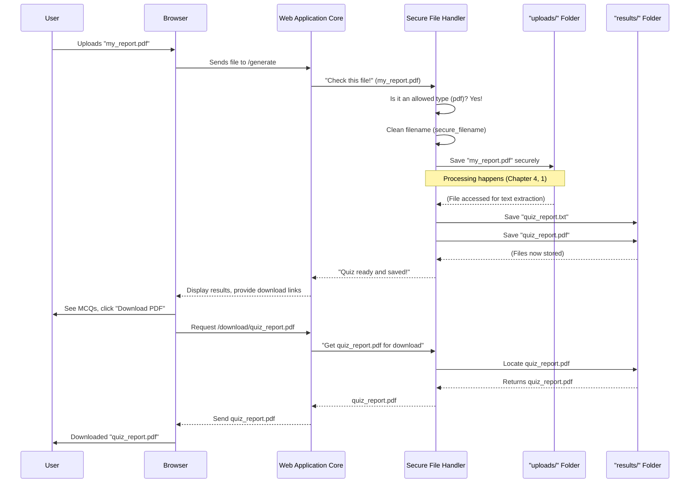

# Chapter 3: Secure File Handler

Welcome back, future quiz masters! In [Chapter 2: Web Application Core](02_web_application_core_.md), we saw how our app creates a friendly web page for you to interact with. You can upload a file and tell the app how many questions you want. But what happens right after you click "Generate" and your file leaves your computer?

Imagine your uploaded file is like a package arriving at a busy mailroom. You wouldn't want just *any* package to come in, especially if it's damaged or mislabeled, right? And you'd want to make sure it goes to the correct storage area. That's exactly the job of the **Secure File Handler** in our project!

## What Problem Does it Solve?

The main goal of the **Secure File Handler** is to act like a super-vigilant **mailroom manager** for our application. It makes sure that every file you upload is handled safely and correctly.

Think about these potential problems:
*   **Wrong type of file:** What if someone uploads a video game instead of a document? Our app needs to know how to read text from PDFs or Word files, not video games!
*   **Harmful filenames:** A tricky user might name their file something like `my_report/../bad_file.txt`. This could try to make our app save the file in the *wrong* place, potentially messing up our system.
*   **Messy storage:** We need clear places to store incoming files and outgoing results, so nothing gets lost or mixed up.

The Secure File Handler solves all these problems by creating a safe environment for file interactions. It's like having a secure mailroom and dispatcher: it receives incoming packages, checks them, sorts them, and later sends out outgoing deliveries, all while ensuring no unauthorized or harmful items pass through and everything is placed correctly.

## Key Concepts: Our Mailroom Rules

To ensure everything runs smoothly, our Secure File Handler follows a few important rules:

### 1. Only Allowed File Types
Just like a mailroom might only accept letters and small packages, our app only processes specific document types. This is crucial because our [Document Text Extractor](04_document_text_extractor_.md) (which we'll cover next) is designed to read text from PDFs, Word documents (`.docx`), and plain text files (`.txt`). Trying to read a picture or a video would simply break our app!

### 2. Safe Filenames
When you upload a file, you give it a name. But what if that name is a bit mischievous? For example, a file named `my_document; delete_all_files.txt` could potentially cause problems if not handled carefully. Our Secure File Handler "cleans" these names, making them safe and simple, ensuring they can't trick our system into doing something unexpected.

### 3. Designated Folders
Imagine your mailroom had one big pile for everything. It would be chaos! Instead, our Secure File Handler uses two dedicated folders:
*   `uploads/`: This is where all the incoming, safely checked user documents are temporarily stored.
*   `results/`: This is where the generated MCQs (both `.txt` and `.pdf` versions) are saved, ready for you to download.
This organization keeps our system tidy and secure.

## How It Works: The File's Journey

Let's see the journey of your file, guided by the Secure File Handler:



## Setting Up Our File Mailroom: Configuration

First, we need to tell our Flask application where our special `uploads` and `results` folders are, and what file types are okay.

```python
# From app.py
import os # For interacting with the operating system (like folders)
from werkzeug.utils import secure_filename # Special tool for safe filenames
from flask import Flask # Our web framework

app = Flask(__name__)
# 1. Where to temporarily store uploaded files
app.config['UPLOAD_FOLDER'] = 'uploads/'
# 2. Where to store the final generated quiz files
app.config['RESULTS_FOLDER'] = 'results/'
# 3. What file extensions are allowed
app.config['ALLOWED_EXTENSIONS'] = {'pdf', 'txt', 'docx'}
```
*   `app.config[...]`: This is like setting up rules for our mailroom. We're telling our app:
    *   "Incoming packages go into a folder named `uploads/`."
    *   "Outgoing packages (results) go into a folder named `results/`."
    *   "We only accept packages that are PDF, TXT, or DOCX files."

And just to be sure those folders actually exist on our server, we create them when the application starts:

```python
# From app.py (at the very bottom, inside `if __name__ == "__main__":`)
if __name__ == "__main__":
    # If the 'uploads' folder doesn't exist, create it
    if not os.path.exists(app.config['UPLOAD_FOLDER']):
        os.makedirs(app.config['UPLOAD_FOLDER'])
    # If the 'results' folder doesn't exist, create it
    if not os.path.exists(app.config['RESULTS_FOLDER']):
        os.makedirs(app.config['RESULTS_FOLDER'])
    # ... (other app.run() code) ...
```
*   `os.path.exists(...)`: Checks if a folder already exists.
*   `os.makedirs(...)`: Creates the folder if it doesn't exist. This ensures our mailroom always has its dedicated storage areas ready!

## Checking and Securing Files: `allowed_file` and `secure_filename`

Now let's look at the functions that do the actual checking and cleaning.

### 1. `allowed_file(filename)`: Checking the Package Type

This function is like the first check at the mailroom: "Is this package allowed here?"

```python
# From app.py
def allowed_file(filename):
    # Check if the filename has a '.' (like document.pdf)
    # Get the part after the last '.' (e.g., 'pdf' from 'document.pdf')
    # Convert it to lowercase (e.g., 'PDF' becomes 'pdf')
    # Check if this extension is in our list of allowed extensions
    return '.' in filename and \
           filename.rsplit('.', 1)[1].lower() in app.config['ALLOWED_EXTENSIONS']
```
*   This function takes a `filename` (like `my_notes.pdf`).
*   It splits the name at the last `.` (`my_notes` and `pdf`).
*   It checks if the extension (`pdf`) is one of the types we've `ALLOWED_EXTENSIONS` (`pdf`, `txt`, `docx`).
*   If it matches, it returns `True`, meaning "yes, this file type is allowed!"

### 2. `secure_filename(filename)`: Cleaning the Package Label

This is a very important step! It takes any filename and makes it safe for our system.

```python
# From app.py (in the `generate_mcqs` function)
from werkzeug.utils import secure_filename # This was imported at the top

# ... (inside generate_mcqs function) ...
file = request.files['file'] # Get the file from the user's upload

if file and allowed_file(file.filename):
    # This line takes the original (potentially unsafe) filename
    # and makes it clean and safe (e.g., "my_report.pdf" -> "my_report.pdf")
    # or ("../bad_file.txt" -> "bad_file.txt")
    filename = secure_filename(file.filename)
    # ... (rest of the code) ...
```
*   The `secure_filename()` function (provided by Flask's helper library `werkzeug`) automatically removes any potentially harmful characters or path information from the filename.
*   It ensures that the filename is simple and can only point to a file *within* the current folder, preventing tricks to access other parts of our server.

## Storing and Delivering Files: `file.save()` and `send_file()`

Finally, let's see how the Secure File Handler stores incoming files and delivers outgoing results.

### Saving the Uploaded File

After checking the file type and securing its name, the file is ready to be saved in our `uploads/` folder.

```python
# From app.py (in the `generate_mcqs` function)

# ... (after filename = secure_filename(file.filename)) ...

    # Create the full path: 'uploads/' + 'my_report.pdf' = 'uploads/my_report.pdf'
    file_path = os.path.join(app.config['UPLOAD_FOLDER'], filename)
    # Save the actual file content to this path on our server
    file.save(file_path)

    # ... (now the text can be extracted from this saved file) ...
```
*   `os.path.join()`: This is a smart way to combine folder names and filenames. It works correctly no matter if you're on Windows or macOS/Linux.
*   `file.save(file_path)`: This is the command that takes the uploaded file's content and writes it to the specified `file_path` on our server. Now the file is safely stored in our `uploads/` folder!

### Serving the Result Files for Download

Once our [MCQ Generation Engine](01_mcq_generation_engine_.md) has done its job and the [Result Formatter & Saver](05_result_formatter___saver_.md) has saved the quiz files in the `results/` folder, the Secure File Handler also helps deliver these files back to the user.

```python
# From app.py (a separate route for downloading)
from flask import send_file # This was imported at the top

@app.route('/download/<filename>')
def download_file(filename):
    # Create the full path to the result file: 'results/' + 'quiz.pdf'
    file_path = os.path.join(app.config['RESULTS_FOLDER'], filename)
    # Send this file to the user's browser for download
    return send_file(file_path, as_attachment=True)
```
*   `@app.route('/download/<filename>')`: This creates a special URL (like `http://127.0.0.1:5000/download/quiz.pdf`) that, when visited, will trigger this function. The `<filename>` part captures whatever name is in the URL (e.g., `quiz.pdf`).
*   `send_file(file_path, as_attachment=True)`: This is Flask's way of saying: "Take the file at this `file_path` and send it to the user's browser, telling the browser to *download* it as an attachment, rather than try to display it."

## Conclusion

In this chapter, we explored the **Secure File Handler**, our application's vigilant mailroom manager. We learned how it ensures that uploaded files are:
*   Of **allowed types** (`pdf`, `txt`, `docx`).
*   Given **safe filenames** using `secure_filename`.
*   Stored in **designated folders** (`uploads/` for incoming, `results/` for outgoing).
And how it helps in delivering the generated quiz files back to the user. This component is crucial for the security and stability of our application, making sure that file interactions are always safe and organized.

With our files now securely handled, the next step is to actually *read* the text from them so our AI can generate questions!

[Next Chapter: Document Text Extractor](04_document_text_extractor_.md)

---

Generated by [AI Codebase Knowledge Builder](https://github.com/The-Pocket/Tutorial-Codebase-Knowledge)