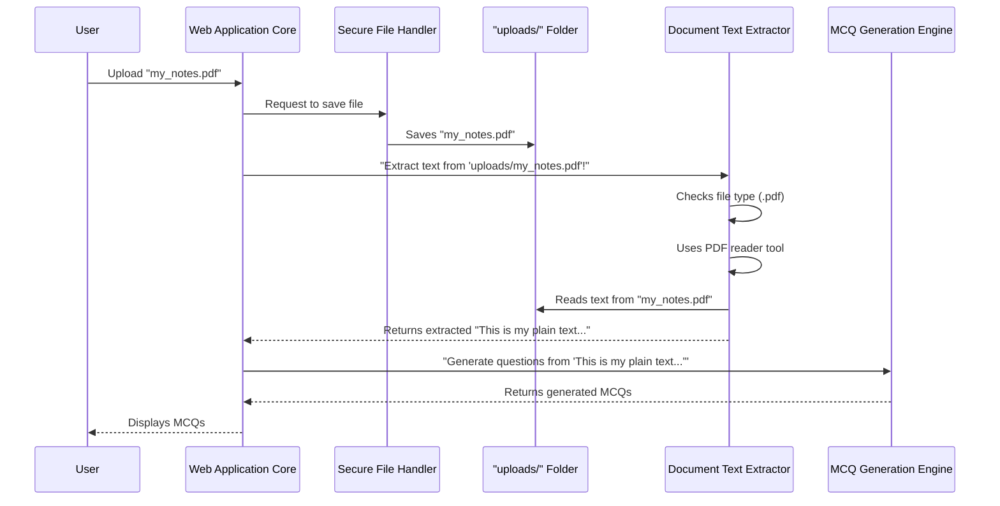

# Chapter 4: Document Text Extractor

Welcome back, aspiring quiz-generating wizards! In our previous chapter, [Chapter 3: Secure File Handler](03_secure_file_handler_.md), we learned how our application acts like a vigilant mailroom manager, safely receiving and storing your uploaded files in the `uploads/` folder. Now that your file is securely nestled on our server, the big question is: How do we actually *read* what's inside it?

Imagine you've uploaded a super important textbook chapter, but it's a PDF. Our [MCQ Generation Engine](01_mcq_generation_engine_.md) (the "brain" of our app) needs to read this text in plain, simple language to create questions. It can't understand fancy PDF formatting or Word document structures. It just wants the raw words!

## What Problem Does it Solve?

This is where the **Document Text Extractor** steps in! Its job is like being a **universal translator** for documents. When you upload a file—whether it's a PDF, a Word document, or a plain text file—the Extractor reads its content, no matter the format, and converts it into plain text. This plain text is then perfectly understandable by our [MCQ Generation Engine](01_mcq_generation_engine_.md).

Think of it this way: You have different types of "containers" for information (PDF, Word, TXT). The Document Text Extractor opens each container, pulls out *only* the written information, and puts it all into a standard "notepad" format that the AI can easily read. Without this component, our AI would be stuck staring at a document it couldn't understand, like trying to read a book in a language you don't know!

## Key Concepts: Speaking Document Languages

To be a "universal translator," our Document Text Extractor needs to understand a few common document "languages":

1.  **PDFs (Portable Document Format):** These files are great for keeping documents looking the same everywhere, but extracting text can be tricky because text often isn't stored in a simple, continuous flow. We need a special tool for this.
2.  **DOCX (Microsoft Word Documents):** These are flexible for editing, and their text is structured with paragraphs and headings. Again, a specific tool helps us read through these structures.
3.  **TXT (Plain Text Files):** These are the simplest! Just raw text, no special formatting. Reading these is straightforward.

Our Document Text Extractor uses specific Python libraries, each acting as a specialized "reader" for one of these document types, to do its job.

## How It Works: The File's New Form

Let's visualize how the Document Text Extractor fits into the journey of your uploaded file:



## Inside the Document Text Extractor: The `extract_text_from_file` Function

The core logic of our Document Text Extractor is contained within a Python function called `extract_text_from_file`. You'll find this function in our `app.py` file.

This function takes the `file_path` (the location where your securely saved file is) and then intelligently decides which "reader" tool to use based on the file's extension.

First, let's look at the imports for the specialized "reader" tools:

```python
# From app.py
import pdfplumber # For reading PDF files
import docx       # For reading Word (.docx) files
# For .txt files, we use Python's built-in file reading, no special import needed.
```
*   `pdfplumber`: This is a fantastic Python library designed specifically for extracting text (and other data) from PDF files.
*   `docx`: This library (often called `python-docx`) allows us to create, modify, and read `.docx` Word documents.

Now, let's look at the `extract_text_from_file` function itself, broken down into manageable parts.

### Step 1: Determine File Type

The first thing our Extractor does is look at the file's extension to know which tool to use.

```python
# From app.py

def extract_text_from_file(file_path):
    # Get the file extension (e.g., 'pdf' from 'document.pdf')
    ext = file_path.rsplit('.', 1)[1].lower()

    # Now, check the extension and use the right tool
    if ext == 'pdf':
        # ... code for PDF extraction ...
    elif ext == 'docx':
        # ... code for DOCX extraction ...
    elif ext == 'txt':
        # ... code for TXT extraction ...
    return None # If it's not a supported type, return nothing
```
*   `file_path.rsplit('.', 1)[1].lower()`: This clever bit of Python code finds the last `.` in the `file_path` and grabs whatever comes after it (the extension). It then converts it to lowercase (e.g., "PDF" becomes "pdf") for easier comparison.
*   The `if/elif` statements then act like a switchboard, directing the file to the correct processing logic.

### Step 2: Extract Text from PDFs

If the file is a PDF, the `pdfplumber` library comes to the rescue.

```python
# From app.py (inside the extract_text_from_file function, under `if ext == 'pdf':`)

        with pdfplumber.open(file_path) as pdf:
            # For each page in the PDF, extract its text and join all text together
            text = ''.join([page.extract_text() for page in pdf.pages])
        return text
```
*   `with pdfplumber.open(file_path) as pdf:`: This line opens the PDF file using `pdfplumber`. The `with` statement ensures the file is properly closed afterwards, even if errors occur.
*   `for page in pdf.pages:`: A PDF document can have many pages. This loop goes through each page one by one.
*   `page.extract_text()`: For each `page` object, `pdfplumber` has a handy method to pull out all the readable text on that page.
*   `''.join([...])`: As we get text from each page, we use `join` to combine all these separate bits of text into one long, continuous string of plain text. This is exactly what our AI needs!

### Step 3: Extract Text from Word Documents (.docx)

For Word documents, we use the `docx` library.

```python
# From app.py (inside the extract_text_from_file function, under `elif ext == 'docx':`)

        doc = docx.Document(file_path)
        # For each paragraph in the Word document, get its text and join them
        text = ' '.join([para.text for para in doc.paragraphs])
        return text
```
*   `doc = docx.Document(file_path)`: This line loads the Word document into a `Document` object that the `docx` library can understand.
*   `for para in doc.paragraphs:`: Word documents are structured into paragraphs. This loop iterates through each paragraph.
*   `para.text`: For each `para` (paragraph) object, we can easily access its plain text content using `.text`.
*   `' '.join([...])`: Similar to PDF, we join all paragraph texts together, separated by spaces, to form one large block of plain text.

### Step 4: Extract Text from Plain Text Files (.txt)

Plain text files are the easiest! Python has built-in ways to read them.

```python
# From app.py (inside the extract_text_from_file function, under `elif ext == 'txt':`)

        with open(file_path, 'r') as file:
            return file.read()
```
*   `with open(file_path, 'r') as file:`: This opens the `.txt` file for reading (`'r'`). Again, the `with` statement ensures proper file handling.
*   `file.read()`: This simple command reads the *entire* content of the text file as a single string. Mission accomplished!

## Connecting to the Web Application Core

Now that we know how `extract_text_from_file` works, let's see where it gets called within our main web application logic. Remember our `generate_mcqs` function from [Chapter 2: Web Application Core](02_web_application_core_.md)? This is where all the pieces come together.

```python
# From app.py (inside the generate_mcqs function)

@app.route('/generate', methods=['POST'])
def generate_mcqs():
    # ... (code to handle file upload and secure filename from Chapter 3) ...
    if file and allowed_file(file.filename):
        filename = secure_filename(file.filename)
        file_path = os.path.join(app.config['UPLOAD_FOLDER'], filename)
        file.save(file_path)

        # THIS IS WHERE OUR Document Text Extractor IS CALLED!
        # It takes the path to the saved file and returns all the text.
        text = extract_text_from_file(file_path)

        if text:
            num_questions = int(request.form['num_questions'])
            # The extracted 'text' is now passed to our MCQ Generation Engine!
            mcqs = Question_mcqs_generator(text, num_questions)

            # ... (code to save and display results from Chapter 5) ...
    return "Invalid file format or error during text extraction."
```
*   After the [Secure File Handler](03_secure_file_handler_.md) has saved the user's file at `file_path`, the very next step is to call `extract_text_from_file(file_path)`.
*   The value returned by this function (`text`) is then the actual, readable content that gets fed into our `Question_mcqs_generator` function (the [MCQ Generation Engine](01_mcq_generation_engine_.md)'s brain!).
*   This seamless handoff is critical for the entire application to work. The Extractor acts as the bridge between raw document files and the AI's need for plain text.

## Conclusion

In this chapter, we unveiled the **Document Text Extractor**, the "universal translator" of our MCQ Generation app. We learned how this crucial component uses specialized tools like `pdfplumber` and `docx` (along with standard Python file operations) to read various document formats (PDF, Word, TXT) and convert their content into plain, understandable text. This extracted text is then passed on to the [MCQ Generation Engine](01_mcq_generation_engine_.md) to do its magic.

Now that we can extract text and generate MCQs, the final step is to neatly present and save these results for the user. Let's move on to see how that's done!

[Next Chapter: Result Formatter & Saver](05_result_formatter___saver_.md)

---

Generated by [AI Codebase Knowledge Builder](https://github.com/The-Pocket/Tutorial-Codebase-Knowledge)