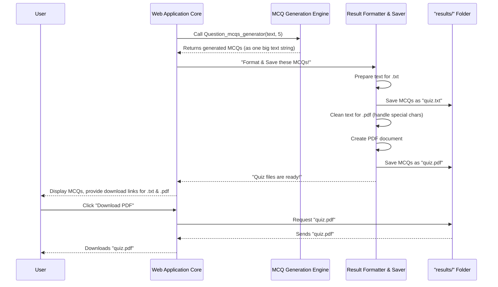

# Chapter 5: Result Formatter & Saver

Welcome back, incredible app builders! So far, we've come a long way. In [Chapter 4: Document Text Extractor](04_document_text_extractor_.md), we learned how to expertly pull plain text from various document types. This plain text was then fed to our "brain," the [MCQ Generation Engine](01_mcq_generation_engine_.md), which magically crafted multiple-choice questions for us.

Now, imagine your amazing AI tutor has finished creating a fantastic quiz. It's given you a long string of text containing all the questions, options, and answers. That's great, but how do you save it for later? How do you give it to a student in a neat, printable format? Just a raw block of text isn't very user-friendly.

## What Problem Does it Solve?

This is where the **Result Formatter & Saver** comes into play! Its job is like being a diligent **librarian and publisher** for our generated quizzes. After the [MCQ Generation Engine](01_mcq_generation_engine_.md) spits out the raw text of the MCQs, this part takes charge of:

1.  **Organizing and formatting** them nicely.
2.  **Saving** them into practical, ready-to-use files.

Think of it: You've just created a quiz. You want to save it as a simple text file (`.txt`) for quick review, and also as a professional-looking PDF document (`.pdf`) that can be easily printed or shared. The Result Formatter & Saver ensures your hard-earned MCQs are properly filed away and "published" into different accessible formats, complete with necessary cleaning for compatibility.

Without this component, all the brilliant questions generated by our AI would just vanish after you close the web page, making the whole effort much less useful!

## Key Concepts: Publishing Your Quiz

To act as our quiz publisher, the Result Formatter & Saver focuses on a few key tasks:

### 1. Saving to a Plain Text File (`.txt`)
This is the simplest format. It takes the raw MCQ text and writes it directly into a `.txt` file. It's like writing notes on a notepad – no fancy formatting, just the words.

### 2. Creating a Professional PDF Document (`.pdf`)
This is more complex! PDFs are great for printing and sharing because they look the same everywhere. To create a PDF, we need a special tool (a library in Python) that can "draw" text onto a virtual page. This also means we need to be careful about special characters.

### 3. Cleaning Text for PDF Compatibility
Some characters (like fancy dashes or curly quotes) might look good on a screen but can cause problems when trying to print them into a PDF, especially with basic PDF libraries. This component ensures all text is "cleaned" and replaced with common, compatible characters before going into the PDF. It's like making sure all the ingredients are suitable before baking!

## How It Works: Your Quiz Gets Published!

Let's visualize the final steps of your quiz's journey after the questions have been generated:



## Inside the Result Formatter & Saver: Publishing Functions

The core of our Result Formatter & Saver is located in our `app.py` file, mainly through three functions: `save_mcqs_to_file`, `clean_text_for_pdf`, and `create_pdf`.

First, let's see the import for our PDF creation tool:

```python
# From app.py
from fpdf import FPDF # For creating PDF files
```
*   `FPDF`: This is a powerful Python library that lets us generate PDFs from scratch. It's like having a specialized printer connected to our app.

### 1. `save_mcqs_to_file()`: The TXT Publisher

This function is straightforward. It takes the raw MCQ text and writes it into a plain text file in our `results/` folder (which we set up in [Chapter 3: Secure File Handler](03_secure_file_handler_.md)).

```python
# From app.py

def save_mcqs_to_file(mcqs, filename):
    # Construct the full path where the file will be saved
    # (e.g., 'results/' + 'generated_mcqs_report.txt')
    results_path = os.path.join(app.config['RESULTS_FOLDER'], filename)

    # Open the file in 'write' mode ('w') and write the MCQs into it
    with open(results_path, 'w', encoding='utf-8') as f:
        f.write(mcqs)

    return results_path # Return the path where the file was saved
```
*   `os.path.join(app.config['RESULTS_FOLDER'], filename)`: This creates the complete path for our file, ensuring it's saved in the correct `results/` folder.
*   `with open(results_path, 'w', encoding='utf-8') as f:`: This opens a file at `results_path` for writing. We specify `encoding='utf-8'` to make sure any special characters from the LLM are handled correctly in the text file.
*   `f.write(mcqs)`: This simply writes the entire block of generated MCQ text into the file.
*   The function then returns the path to the newly created file.

### 2. `clean_text_for_pdf()`: The Text Cleaner

Before we put text into a PDF, especially with some PDF libraries, we need to ensure it uses characters that the PDF library can easily understand. This function replaces some common "fancy" characters (like those specific types of dashes or quotes) with their simpler counterparts.

```python
# From app.py

def clean_text_for_pdf(text):
    # Define a dictionary of problematic Unicode characters and their simpler replacements
    replacements = {
        '\u2013': '-',  # en dash (a short dash)
        '\u2014': '-',  # em dash (a longer dash)
        '\u2018': "'", # left single quote
        '\u2019': "'", # right single quote
        '\u201c': '"', # left double quote
        '\u201d': '"', # right double quote
    }
    for uni, rep in replacements.items():
        text = text.replace(uni, rep) # Apply each replacement

    # Finally, encode the text to 'latin1' and replace any characters
    # that still aren't compatible with 'latin1'. This makes it safe for FPDF.
    return text.encode('latin1', 'replace').decode('latin1')
```
*   `replacements = { ... }`: This dictionary lists common Unicode characters that `FPDF` (when using its default fonts) might struggle with, along with their safe, standard replacements.
*   `for uni, rep in replacements.items(): text = text.replace(uni, rep)`: This loop goes through each problematic character and replaces it with its safer alternative throughout the `text`.
*   `text.encode('latin1', 'replace').decode('latin1')`: This is a clever trick! It tries to convert the text into the `latin1` encoding. If it encounters any character that `latin1` doesn't support, it `replace`s it with a default "replacement character" (often a question mark or a box). Then, it immediately decodes it back to a standard string. This ensures that only `latin1` compatible characters remain, which `FPDF` handles well.

### 3. `create_pdf()`: The PDF Publisher

This is the function that actually "prints" our MCQs into a PDF document using the `FPDF` library.

```python
# From app.py

def create_pdf(mcqs, filename):
    pdf = FPDF() # Create a new PDF document object
    pdf.add_page() # Add a blank page to our PDF
    pdf.set_font("Arial", size=12) # Set the font to Arial, size 12

    # Split the MCQs string by "## MCQ" to get individual questions
    for mcq_block in mcqs.split("## MCQ"):
        if mcq_block.strip(): # Check if there's actual content in the block
            # Clean the text to ensure PDF compatibility
            safe_mcq_block = clean_text_for_pdf(mcq_block.strip())
            # Add the cleaned text to the PDF. multi_cell handles line breaks automatically.
            pdf.multi_cell(0, 10, safe_mcq_block)
            pdf.ln(5)  # Add a small line break after each MCQ

    # Construct the full path for the PDF file
    pdf_path = os.path.join(app.config['RESULTS_FOLDER'], filename)
    pdf.output(pdf_path) # Save the generated PDF to the specified path
    return pdf_path
```
*   `pdf = FPDF()`: Initializes our PDF "printer."
*   `pdf.add_page()`: Every PDF needs at least one page.
*   `pdf.set_font("Arial", size=12)`: We choose a standard font and size for readability.
*   `for mcq_block in mcqs.split("## MCQ"):`: Remember, our [MCQ Generation Engine](01_mcq_generation_engine_.md) formats MCQs with `## MCQ` as a separator. We use this to break the big string into individual question blocks.
*   `safe_mcq_block = clean_text_for_pdf(mcq_block.strip())`: Here, we call our text cleaning function to make sure the MCQ text is safe for PDF printing.
*   `pdf.multi_cell(0, 10, safe_mcq_block)`: This is the core `FPDF` command to add text. `0` means the cell width expands to the page margin, `10` is the height of each line, and `safe_mcq_block` is the text. `multi_cell` is great because it automatically wraps text to the next line if it's too long for the current line.
*   `pdf.ln(5)`: Adds a blank line of 5 units, making sure there's space between questions.
*   `pdf.output(pdf_path)`: This is the crucial step that actually saves the created PDF to a file on our server.

### Connecting to the Web Application Core

Finally, let's look at how these saving and formatting functions are called within our main `generate_mcqs` function (from [Chapter 2: Web Application Core](02_web_application_core_.md)), bringing everything together:

```python
# From app.py (inside the generate_mcqs function)

@app.route('/generate', methods=['POST'])
def generate_mcqs():
    # ... (code for file upload, text extraction, and MCQ generation) ...

    if text:
        num_questions = int(request.form['num_questions'])
        mcqs = Question_mcqs_generator(text, num_questions) # Our generated MCQs

        # Create unique filenames for our result files
        base_filename = filename.rsplit('.', 1)[0] # e.g., 'report' from 'report.pdf'
        txt_filename = f"generated_mcqs_{base_filename}.txt"
        pdf_filename = f"generated_mcqs_{base_filename}.pdf"

        # THIS IS WHERE OUR RESULT FORMATTER & SAVER IS CALLED!
        save_mcqs_to_file(mcqs, txt_filename) # Save as plain text
        create_pdf(mcqs, pdf_filename)       # Create and save as PDF

        # Render the results page, passing the MCQs and filenames for download
        return render_template('results.html', mcqs=mcqs, txt_filename=txt_filename, pdf_filename=pdf_filename)
    return "Invalid file format or error during text extraction."
```
*   After `mcqs = Question_mcqs_generator(...)` has returned the questions, we generate two unique filenames, one for the `.txt` and one for the `.pdf`.
*   Then, `save_mcqs_to_file(mcqs, txt_filename)` is called to create the plain text quiz file.
*   Immediately after, `create_pdf(mcqs, pdf_filename)` is called to generate the PDF version.
*   Both files are stored in our `results/` folder, making them available for the user to download via the links provided on the `results.html` page (using the `download_file` route from [Chapter 3: Secure File Handler](03_secure_file_handler_.md)).

## Conclusion

In this chapter, we explored the **Result Formatter & Saver**, the "publisher" of our application. We learned how it takes the raw MCQs generated by our AI and transforms them into user-friendly `.txt` and `.pdf` files. We saw how `save_mcqs_to_file` creates simple text documents, how `clean_text_for_pdf` ensures text compatibility, and how `create_pdf` uses `FPDF` to generate professional-looking PDF quizzes.

This component ensures that all the hard work of our [MCQ Generation Engine](01_mcq_generation_engine_.md) is saved and made accessible, completing the entire workflow from document upload to downloadable quiz! You've now built an amazing, full-featured MCQ generation app!

---

Generated by [AI Codebase Knowledge Builder](https://github.com/The-Pocket/Tutorial-Codebase-Knowledge)