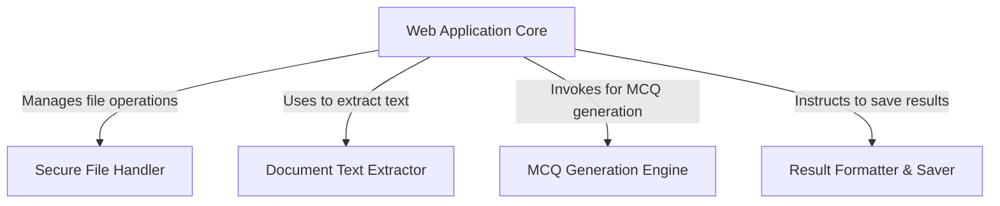

# Tutorial: MCQ-Generator-using-LLM

This project is a user-friendly *web application* that helps you **automatically generate multiple-choice questions** from your uploaded documents. You simply provide a file (like a PDF or Word document), and it uses an *intelligent AI* to read the content, create questions, and then lets you **download the quizzes** in both text and PDF formats for easy use.

**Source Repository:** [https://github.com/PrathamPatil17/MCQ-Generator-using-LLM](https://github.com/PrathamPatil17/MCQ-Generator-using-LLM)

## Chapters

1. [MCQ Generation Engine
](01_mcq_generation_engine_.md)
2. [Web Application Core
](02_web_application_core_.md)
3. [Secure File Handler
](03_secure_file_handler_.md)
4. [Document Text Extractor
](04_document_text_extractor_.md)
5. [Result Formatter & Saver
](05_result_formatter___saver_.md)

---

Generated by [AI Codebase Knowledge Builder](https://github.com/The-Pocket/Tutorial-Codebase-Knowledge)